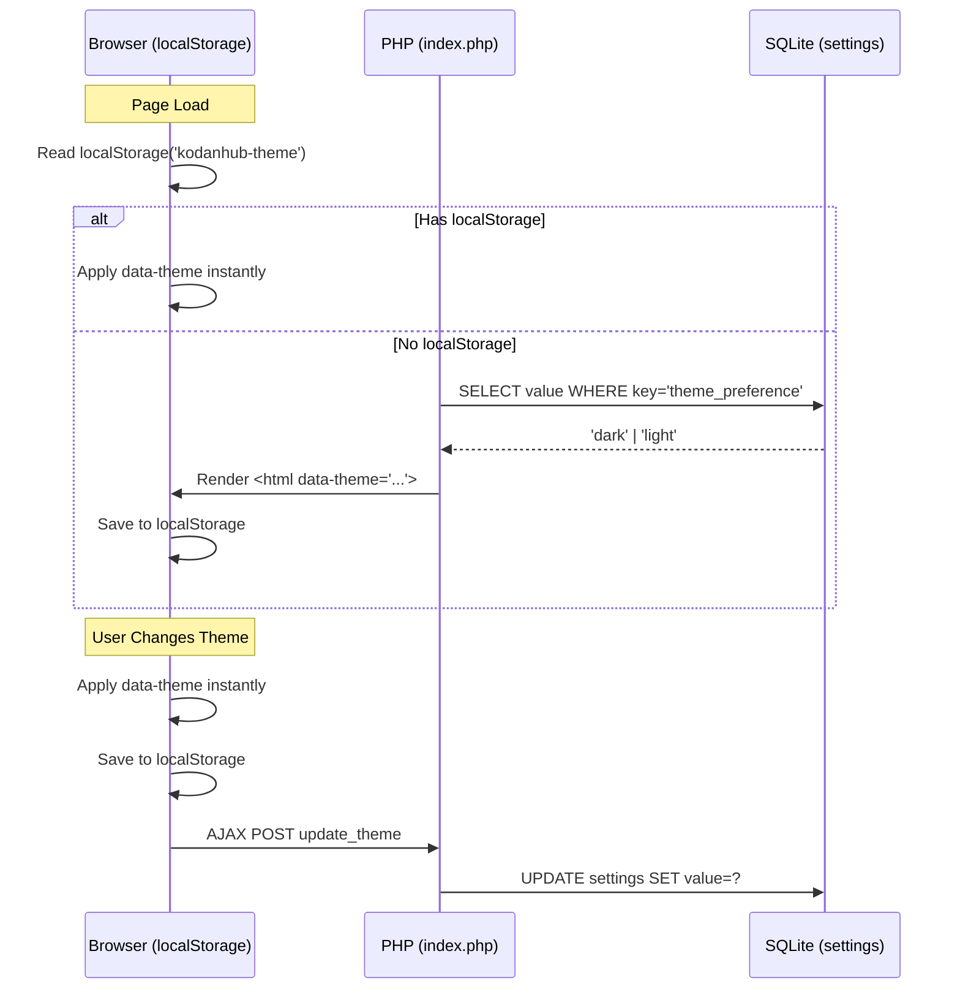

# Implementación de Sistema Dual Theme (Dark/Light) en kodanHUB

Refactorización completa del sistema de estilos para soportar temas dark y light con persistencia en BD, migración a tokens Material 3, y corrección de bugs.

## User Review Required

> [!IMPORTANT]
> **Breaking visual change**: La paleta completa cambia. Los colores actuales (`#050505`, `#00FFC2`, `#111111`) serán reemplazados por los tokens de los design docs (`#0b1326`, `#81ffed`, `#171f33` para dark; `#faf8ff`, `#006a60` para light). La identidad visual va a cambiar perceptiblemente.

> [!WARNING]
> **Tipografía**: Se migra de Inter a Montserrat (headlines) + Hanken Grotesk (body). Esto impacta el peso visual de toda la plataforma. Las fuentes se cargarán desde Google Fonts.

> [!CAUTION]
> **Logo SVG**: Se adapta al tema. En dark mantiene el glow neon. En light, los trazos cambian a `--primary` (#006a60) sólido sin filtro glow. El filtro SVG se activa/desactiva vía `[data-theme]` en CSS. Esto requiere modificar el SVG inline en `index.php` y `login.php`.

---

## Decisiones Resueltas

| Decisión | Resolución |
|---|---|
| Fuente de verdad para tipografía | Design docs → Montserrat + Hanken Grotesk |
| Fuente de verdad para paleta | Design docs → Tokens Material 3 |
| Mecanismo de theming | `[data-theme]` en `<html>` con CSS Custom Properties |
| Persistencia | localStorage (instantáneo) + SQLite (sync background) |
| Tema por defecto | Dark |
| UI de selección | Cajas cuadradas con preview visual de cada tema dentro del configModal con tabs |
| Login page | Responde al tema (lee localStorage) |
| Transición de tema | Suave (`transition: background-color 0.3s, color 0.3s, border-color 0.3s`) |
| Logo SVG | Adaptable: glow neon en dark, trazos sólidos `--primary` sin glow en light |
| Toasts | Refactorizar para usar variables CSS |
| `style.css` legacy | Eliminar |
| Bug update_password | Arreglar |

---

## Proposed Changes

### 1. Migración de BD — Script Independiente

#### [NEW] [migration_add_theme.php](file:///c:/Proyectos_Antigravity/kodanHUB/migration_add_theme.php)

Script PHP independiente que agrega `theme_preference` a la tabla `settings`:

```sql
INSERT OR IGNORE INTO settings (key, value) VALUES ('theme_preference', 'dark');
```

Usa la tabla `settings` existente (key-value store usado por `admin_password`).

---

### 2. Reescritura CSS — Arquitectura de Tokens

#### [MODIFY] [modern-hub.css](file:///c:/Proyectos_Antigravity/kodanHUB/admin/css/modern-hub.css)

Cambios principales:

1. **Google Fonts**: Reemplazar `Inter` por `Montserrat:wght@600;700` + `Hanken Grotesk:wght@400;500;700`
2. **`:root` (Dark default)**: Reemplazar las 6 variables actuales por ~30 tokens semánticos del design doc DARK:
   - `--surface`, `--surface-dim`, `--surface-bright`, `--surface-container-*`
   - `--on-surface`, `--on-surface-variant`
   - `--primary`, `--on-primary`, `--primary-container`
   - `--secondary`, `--tertiary`, `--error` + sus variantes
   - `--outline`, `--outline-variant`
   - Aliases de UX: `--bg` → `--surface`, `--text` → `--on-surface`, `--text-muted` → `--on-surface-variant`, `--accent` → `--primary`
3. **`[data-theme="light"]`**: Override de todas las variables de color con los tokens del design doc LIGHT
4. **Transición global**: `*, *::before, *::after { transition: background-color 0.3s, color 0.3s, border-color 0.3s, box-shadow 0.3s; }` (con `@media (prefers-reduced-motion)` fallback)
5. **Migrar todos los hex hardcodeados** en selectores a `var(--token)`. Incluye:
   - `aside.sidebar` → `background-color: var(--surface-container-lowest)`
   - `.stat-card` → `background-color: var(--surface-container)`
   - `.glass-container` → `background-color: var(--surface-container)`
   - `.btn-neural` → `background-color: var(--primary); color: var(--on-primary)`
   - `.modal-content` → `background-color: var(--surface-container)`
   - Todos los inputs, badges, bordes, hovers
6. **Tipografía**: `body { font-family: 'Hanken Grotesk', sans-serif; }`, headings → `'Montserrat', sans-serif`
7. **Nuevos estilos**: `.theme-selector`, `.theme-card`, `.theme-card.active`, tabs del configModal

#### [DELETE] [style.css](file:///c:/Proyectos_Antigravity/kodanHUB/admin/css/style.css)

Archivo legacy sin importar. Eliminarlo.

---

### 3. JavaScript — Theme Engine + Toast Refactor

#### [MODIFY] [neural-ui.js](file:///c:/Proyectos_Antigravity/kodanHUB/admin/js/neural-ui.js)

1. **Theme Engine** (nuevo módulo al inicio del archivo):
   ```javascript
   const ThemeEngine = {
       init() { /* lee localStorage, aplica data-theme, sync con BD */ },
       set(theme) { /* aplica, persiste en localStorage, AJAX a BD */ },
       get() { /* lee localStorage || 'dark' */ }
   };
   ```
2. **Toast refactor**: Reemplazar todos los hex hardcodeados en `showToast()` por `var(--token)`:
   - `#0a0a0a` → `var(--surface-container-lowest)`
   - `#00FFC2` → `var(--primary)`
   - `#ff4d4d` → `var(--error)`
   - `rgba(0,0,0,0.9)` → `var(--surface-dim)`

---

### 4. Admin Panel — Config Modal + Theme Selector

#### [MODIFY] [index.php](file:///c:/Proyectos_Antigravity/kodanHUB/admin/index.php)

1. **`<html>` tag**: Agregar `data-theme` inyectado por PHP desde BD:
   ```php
   <?php $theme = $db->select('settings', ['value'], ['key' => 'theme_preference'])[0]['value'] ?? 'dark'; ?>
   <html lang="es" data-theme="<?php echo htmlspecialchars($theme); ?>">
   ```
2. **Anti-FOUC script**: Inyectar `<script>` inline en `<head>` ANTES del CSS:
   ```javascript
   (function(){var t=localStorage.getItem('kodanhub-theme')||'dark';document.documentElement.setAttribute('data-theme',t)})();
   ```
3. **configModal rediseño**: Reemplazar el form simple por un modal con 2 secciones:
   - **Sección "Apariencia"**: Dos cajas cuadradas (~120×90px) con preview miniatura de cada tema (mini-sidebar + mini-cards con los colores reales del tema). Borde `--primary` en la activa. Cambio instantáneo al click.
   - **Sección "Seguridad"**: Form de cambio de contraseña (el existente)
4. **Cargar Montserrat + Hanken Grotesk**: Actualizar el `<link>` de Google Fonts

#### [MODIFY] [login.php](file:///c:/Proyectos_Antigravity/kodanHUB/admin/login.php)

1. Agregar el mismo anti-FOUC script en `<head>`
2. Actualizar Google Fonts link
3. Los estilos ya responderán al tema via las variables CSS

---

### 5. Backend — Endpoints de Theme + Fix Password

#### [MODIFY] [actions.php](file:///c:/Proyectos_Antigravity/kodanHUB/admin/actions.php)

1. **Nuevo case `update_theme`**: AJAX endpoint que hace `UPDATE settings SET value = ? WHERE key = 'theme_preference'`. Valida que el valor sea `'dark'` o `'light'`.
2. **Nuevo case `update_password`**: Hashea con `password_hash()` y hace `UPDATE settings SET value = ? WHERE key = 'admin_password'`. Fix del bug actual donde la UI envía pero el backend no procesa.

---

## Arquitectura de Datos del Theme



---

## Verification Plan

### Manual Verification
1. Verificar que el tema dark renderiza con la paleta del design doc DARK
2. Verificar que el tema light renderiza con la paleta del design doc LIGHT
3. Verificar que el cambio de tema es instantáneo con transición suave
4. Verificar que la preferencia persiste en refresh (localStorage)
5. Verificar que la preferencia se sincroniza a BD (inspeccionar SQLite)
6. Verificar que el login respeta el tema elegido
7. Verificar que los toasts se adaptan al tema
8. Verificar que el cambio de contraseña funciona
9. Verificar que el logo muestra glow neon en dark y trazos sólidos sin glow en light
10. Verificar FOUC: no debe haber flash de tema incorrecto al cargar
