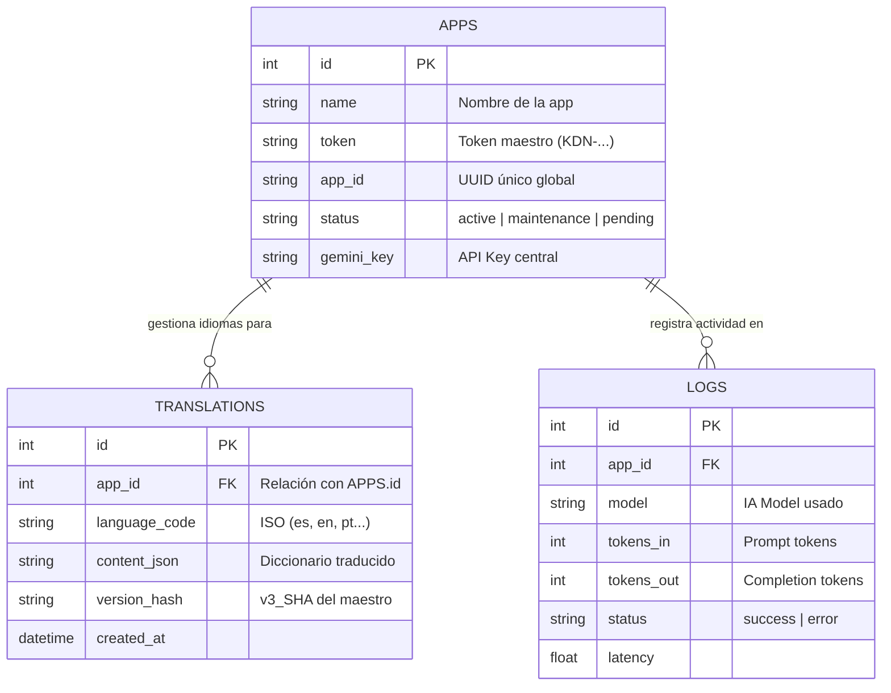

# Documentación Técnica KODAN-HUB v3.0

## 1. Arquitectura del Sistema
KODAN-HUB es una pasarela (Gateway) **agnóstica de servicios**. Centraliza la seguridad de APIs críticas y, desde la v3.0, gestiona la **infraestructura de internacionalización dinámica** para todas las aplicaciones del ecosistema Antigravity.

### 1.1 Diagrama de Entidades (ERD) v3.0
Representación de las entidades principales incluyendo el motor de traducciones.



---

## 2. Flujos de Operación Avanzados

### 2.1 Sincronización Multilingüe (i18n Sync)
Este flujo garantiza que todas las aplicaciones tengan sus textos actualizados sin intervención manual.

1.  **Detección de Cambio**: La App genera un hash (`v3_hash`) basado en su archivo local `es.json`.
2.  **Registro de Maestro (Bypass)**: Si el hash cambia, la App envía el nuevo `es.json` al HUB. El HUB persiste este JSON directamente (sin costo de IA) y **elimina todas las traducciones de otros idiomas** para esa App.
3.  **Traducción On-Demand**: Cuando la App solicita un idioma (ej: `en`), el HUB detecta que no hay cache (fue borrado en el paso 2), invoca a Gemini para traducir el nuevo maestro y guarda el resultado.

### 2.2 Protocolo de Hash de Versión
Para evitar estados inconsistentes, el sistema utiliza un prefijo de versión en los hashes (`v3_`). 
*   **Invalida Caches Locales**: Si el hash del archivo físico no coincide con el guardado en el teléfono, se borra el cache local.
*   **Invalida Caches de Servidor**: Si el hash enviado por la App no coincide con el del HUB, el HUB re-traduce todo el proyecto.

---

## 3. Especificación de API (i18n)

### 3.1 Endpoint de Traducción
`POST /index.php`

#### Payload (Action: get_translation)
```json
{
  "action": "get_translation",
  "lang": "en",
  "v_hash": "v3_1669574185",
  "source_json": { ... }
}
```

#### Reglas de Negocio del HUB:
- **Idioma 'es'**: Bypass total. El HUB guarda el JSON y lo marca como `master_sync`.
- **Otros Idiomas**: Invocación a Gemini Flash con un prompt técnico estricto para mantener la integridad de las llaves JSON.
- **Cache Hit**: Si `v_hash` coincide con el registro en DB, se devuelve el JSON en < 100ms sin tocar la IA.

---

## 4. Gestión de Seguridad
- **Ocultamiento de Keys**: Ninguna aplicación cliente posee la `GEMINI_API_KEY`.
- **Handshake v2.0**: Registro automático de dispositivos nuevos en estado `pending`.
- **Mantenimiento Global**: Posibilidad de pausar todas las apps desde una sola bandera en el HUB.

---

## 5. Instrucciones de Instalación y Migración
1.  **Instalación Base**: Subir archivos al servidor.
2.  **Base de Datos**: Ejecutar `setup_db.php`.
3.  **Migraciones de Idioma**: Ejecutar `migration_v3.php` para crear la tabla de `translations`.
4.  **Configuración de App**: Asegurarse de que el `APP_ID` en la aplicación móvil coincida con el registro del HUB.
