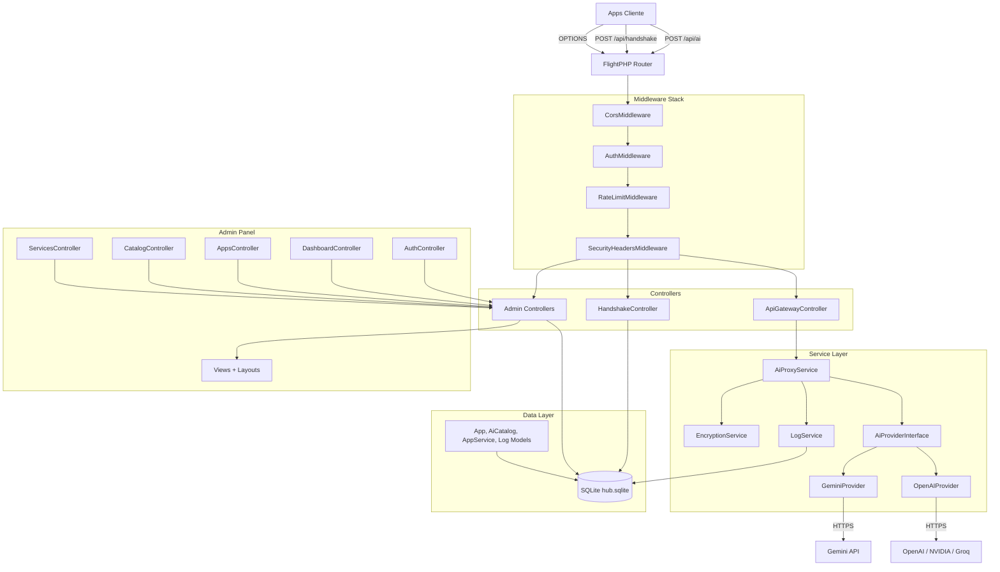

# Plan de Migración: kodanHUB → FlightPHP v3

> **Versión:** 1.0
> **Fecha:** 2026-05-27
> **Destino:** `https://hubv2.kodan.software`
> **Framework destino:** [FlightPHP v3](https://docs.flightphp.com/es/v3/)

---

## Índice

1. [Análisis Crítico del Estado Actual](#1-análisis-crítico-del-estado-actual)
2. [Estructura Post-Migración](#2-estructura-post-migración)
3. [Plan por Fases](#3-plan-por-fases)
   - [Fase 0 — Preparación y Fundación](#fase-0--preparación-y-fundación)
   - [Fase 1 — Capa de Base de Datos](#fase-1--capa-de-base-de-datos)
   - [Fase 2 — API Gateway](#fase-2--api-gateway-corazón-del-sistema)
   - [Fase 3 — Service Layer](#fase-3--service-layer-proxies-de-ai)
   - [Fase 4 — Admin Panel](#fase-4--admin-panel-la-gran-migración)
   - [Fase 5 — Seguridad Hardening](#fase-5--seguridad-hardening)
   - [Fase 6 — Limpieza y Dead Code Removal](#fase-6--limpieza-y-dead-code-removal)
   - [Fase 7 — Tests y Documentación](#fase-7--tests-y-documentación)
4. [Timeline y Dependencias](#4-timeline-estimado)
5. [Riesgos y Mitigaciones](#5-riesgos-y-mitigaciones)
6. [Cambios Requeridos en Apps Cliente](#6-cambios-requeridos-en-apps-cliente)
7. [Preguntas Abiertas al Equipo](#7-preguntas-clave-al-equipo)

---

## 1. Análisis Crítico del Estado Actual

El código fuente de kodanHUB en su estado actual (v1.0.51) presenta los siguientes problemas arquitectónicos:

| Problema | Severidad | Impacto |
|---|---|---|
| **Sin framework** — routing manual con `switch/case`, sin DI, sin middleware | 🔴 Crítico | Mantenibilidad 0, testabilidad inexistente |
| **Static abuse** — toda lógica de negocio son `public static` | 🔴 Crítico | Acoplamiento total, imposible mockear en tests |
| **API keys en texto plano** en `app_services.api_key` | 🔴 Crítico | Vulnerabilidad de seguridad crítica |
| **Admin panel monolítico** — 854 líneas de HTML+JS+PHP en `admin/index.php` | 🟠 Alto | Mantenibilidad pésima, sin separación de concerns |
| **No autoloading** — `require_once` manual bypassing Composer PSR-4 | 🟠 Alto | Código frágil, propenso a errores de inclusión |
| **Dead code** — `GeminiService.php`, `bootstrap.php`, `Mailer` (stubbed) | 🟡 Medio | Ruido, confusión, falsas dependencias |
| **Unused dependencies** — `vlucas/phpdotenv`, `nesbot/carbon`, `catfan/medoo` | 🟡 Medio | Bloat innecesario en `composer.json` |
| **`CURLOPT_SSL_VERIFYPEER = false`** en ambos proxies | 🔴 Crítico | MITM, seguridad cero en producción |
| **Sin rate limiting, sin token expiry, sin logs rotativos** | 🟡 Medio | Superficie de ataque amplia |
| **No environment config** — paths hardcodeados en `Database.php` | 🟡 Medio | Imposible tener dev/staging/prod distintos |

### Por qué FlightPHP v3

| Requisito | FlightPHP | Laravel | Slim | Symfony |
|---|---|---|---|---|
| Cero dependencias nucleo | ✅ | ❌ | ❌ | ❌ |
| Curva de aprendizaje baja | ✅ | ❌ | ✅ | ❌ |
| Routing simple con middleware | ✅ | ✅ | ✅ | ✅ |
| DI Container opcional | ✅ | Obligatorio | ✅ | Obligatorio |
| Rendimiento (req/s) | ~190k | ~26k | ~89k | ~65k |
| Compatible con PHP 8.0+ | ✅ | ✅ | ✅ | ✅ |
| Ideal para APIs/IA Gateway | ✅ | ❌ (pesado) | ✅ | ❌ (pesado) |

FlightPHP es la opción óptima porque kodanHUB es esencialmente un **API Gateway de AI** — necesita ser rápido, liviano, con routing limpio y middleware para auth/CORS, sin el overhead de un framework completo.

---

## 2. Estructura Post-Migración

```
kodanHUB/
├── public/                        # Web root (lo que expone Apache/Nginx)
│   ├── index.php                  # Front controller de Flight
│   ├── .htaccess                  # Rewrite rules (Apache)
│   └── assets/
│       ├── css/
│       │   └── admin.css          # modern-hub.css migrado
│       └── js/
│           └── admin.js           # neural-ui.js migrado
│
├── app/                           # Código de la aplicación
│   ├── config/
│   │   ├── config.php             # Flight config + carga de .env
│   │   └── routes.php             # Definición centralizada de rutas
│   │
│   ├── controllers/
│   │   ├── ApiGatewayController.php   # POST /api/ai
│   │   ├── HandshakeController.php    # POST /api/handshake
│   │   ├── HealthController.php       # GET /api/health
│   │   └── Admin/
│   │       ├── DashboardController.php
│   │       ├── AuthController.php      # Login/logout
│   │       ├── AppsController.php      # CRUD apps
│   │       ├── CatalogController.php   # CRUD ai_catalog
│   │       └── ServicesController.php  # CRUD app_services
│   │
│   ├── middlewares/
│   │   ├── CorsMiddleware.php
│   │   ├── AuthMiddleware.php          # Validación token API
│   │   ├── AdminAuthMiddleware.php     # Validación sesión admin
│   │   ├── RateLimitMiddleware.php
│   │   └── SecurityHeadersMiddleware.php
│   │
│   ├── models/
│   │   ├── App.php
│   │   ├── AiCatalog.php
│   │   ├── AppService.php
│   │   └── Log.php
│   │
│   ├── services/
│   │   ├── AiProxyService.php          # Orquestador de providers
│   │   ├── Providers/
│   │   │   ├── AiProviderInterface.php  # Interfaz común
│   │   │   ├── GeminiProvider.php       # Gemini API (refactorizado)
│   │   │   └── OpenAIProvider.php       # OpenAI/NVIDIA/Groq (refactorizado)
│   │   ├── LogService.php              # Audit logging refactorizado
│   │   └── EncryptionService.php       # Cifrado de API keys
│   │
│   ├── views/
│   │   ├── layouts/
│   │   │   └── admin.php               # Layout base del admin
│   │   ├── dashboard.php
│   │   ├── login.php
│   │   ├── apps/
│   │   │   ├── index.php
│   │   │   └── form.php
│   │   ├── catalog/
│   │   │   ├── index.php
│   │   │   └── form.php
│   │   └── services/
│   │       └── index.php
│   │
│   └── commands/
│       ├── RotateTokensCommand.php     # CLI para rotación de tokens
│       └── EncryptExistingKeysCommand.php # Migrar keys existentes
│
├── config/
│   └── .env                           # Variables de entorno
│
├── data/
│   └── hub.sqlite                      # Base de datos SQLite (sin cambios)
│
├── migrations/
│   └── 001_add_encrypted_keys.php      # Migración: cifrar API keys
│
├── tests/
│   ├── Unit/
│   │   ├── Services/
│   │   │   ├── GeminiProviderTest.php
│   │   │   ├── OpenAIProviderTest.php
│   │   │   └── EncryptionServiceTest.php
│   │   └── Middlewares/
│   │       ├── AuthMiddlewareTest.php
│   │       └── RateLimitMiddlewareTest.php
│   └── Integration/
│       ├── ApiGatewayTest.php
│       └── AdminPanelTest.php
│
├── logs/                              # Logs del sistema
│
├── vendor/                            # Composer dependencies
├── composer.json
├── .env.example                       # Template de variables de entorno
├── .htaccess                          # Redirige a public/
├── deploy.ps1                         # Script de deploy actualizado
└── VERSION                            # Versión del proyecto
```

---

## 3. Plan por Fases

---

### Fase 0 — Preparación y Fundación

**Objetivo:** Instalar FlightPHP, establecer la estructura base, configurar autoloading y entorno.

**Tiempo estimado:** 1 día

#### Pasos

1. **Actualizar `composer.json`**
   ```json
   {
     "require": {
       "php": ">=8.0",
       "flightphp/core": "^3.10",
       "vlucas/phpdotenv": "^5.6",
       "defuse/php-encryption": "^2.4",
       "flightphp/session": "^1.0"
     },
     "require-dev": {
       "phpunit/phpunit": "^10.0"
     },
     "autoload": {
       "psr-4": {
         "App\\": "app/"
       }
     }
   }
   ```
   - Eliminar `catfan/medoo`, `nesbot/carbon` (no utilizados)
   - `vlucas/phpdotenv` se mantiene y AHORA se usa realmente
   - Ejecutar `composer update`

2. **Crear `config/.env`** con valores por entorno
   ```
   APP_ENV=development
   APP_DEBUG=true
   DB_PATH=data/hub.sqlite
   CORS_ORIGIN_REGEX=/^https?:\/\/(.*\.?kodan\.software)$/
   API_KEY_ENCRYPTION_KEY=generar_clave_segura_aqui
   RATE_LIMIT_REQUESTS=10
   RATE_LIMIT_WINDOW=60
   ```

3. **Crear `public/` como nuevo document root**
   - Mover `.htaccess` a `public/` con reglas limpias
   - `.htaccess` raíz que redirige a `public/`

4. **Crear `public/index.php`** — Front Controller
   ```php
   <?php
   require __DIR__ . '/../vendor/autoload.php';

   // Cargar variables de entorno
   $dotenv = Dotenv\Dotenv::createImmutable(__DIR__ . '/../config');
   $dotenv->load();

   // Configurar Flight
   require __DIR__ . '/../app/config/config.php';

   // Definir rutas
   require __DIR__ . '/../app/config/routes.php';

   // Iniciar la aplicación
   Flight::start();
   ```

5. **Crear `app/config/config.php`**
   ```php
   <?php
   use flight\database\SimplePdo;

   // Configuración del framework
   Flight::set('flight.base_url', '/');
   Flight::set('flight.log_errors', $_ENV['APP_ENV'] === 'production');
   Flight::set('flight.handle_errors', true);
   Flight::set('flight.content_length', false);

   // Autoloading de clases
   Flight::path(__DIR__ . '/../');

   // Registrar base de datos
   $dbPath = realpath(__DIR__ . '/../../' . $_ENV['DB_PATH']);
   Flight::register('db', SimplePdo::class, [
       'sqlite:' . $dbPath, '', '', [
           PDO::ATTR_ERRMODE => PDO::ERRMODE_EXCEPTION,
           PDO::ATTR_DEFAULT_FETCH_MODE => PDO::FETCH_ASSOC
       ]
   ]);

   // Forzar foreign keys en SQLite
   Flight::db()->runQuery('PRAGMA foreign_keys = ON');
   ```

6. **Crear `app/config/routes.php`** — inicialmente vacío, se puebla en fases posteriores

#### Checklist de Validación

- [ ] `composer install` sin errores
- [ ] `php -S localhost:8000 -t public/` responde 200
- [ ] Autoloading PSR-4 funciona (`new App\Controllers\TestController`)
- [ ] `.env` es cargado correctamente (`var_dump($_ENV['APP_ENV'])`)
- [ ] `Flight::db()` retorna una instancia válida de SimplePdo
- [ ] La base de datos SQLite existente se conecta sin errores

---

### Fase 1 — Capa de Base de Datos

**Objetivo:** Reemplazar el custom `Medoo.php` por `Flight\database\SimplePdo` y crear los models.

**Tiempo estimado:** 1 día

#### Pasos

1. **Eliminar archivos legacy**
   - `src/Core/Medoo.php`
   - `src/Core/Database.php`

2. **Registrar SimplePdo** en `app/config/config.php` (ya incluido en Fase 0)

3. **Crear models con SimplePdo**

   **`app/models/App.php`:**
   ```php
   <?php
   namespace App\Models;

   use Flight;

   class App
   {
       public static function findByToken(string $token): ?array
       {
           $app = Flight::db()->fetchRow(
               "SELECT * FROM apps WHERE (token = ? OR old_token = ?) AND status = 'active'",
               [$token, $token]
           );
           return $app ? $app->getData() : null;
       }

       public static function findById(int $id): ?array
       {
           $app = Flight::db()->fetchRow("SELECT * FROM apps WHERE id = ?", [$id]);
           return $app ? $app->getData() : null;
       }

       public static function register(string $appId, string $name): array
       {
           $token = 'kdn-' . bin2hex(random_bytes(16));
           Flight::db()->insert('apps', [
               'app_id' => $appId,
               'name' => $name,
               'token' => $token,
               'status' => 'active'
           ]);
           return [
               'id' => Flight::db()->lastInsertId(),
               'token' => $token,
               'app_id' => $appId
           ];
       }

       // ... más métodos: getAll, update, delete, rotateToken, etc.
   }
   ```

   **`app/models/Log.php`:**
   ```php
   <?php
   namespace App\Models;

   use Flight;

   class Log
   {
       public static function create(array $data): int
       {
           Flight::db()->insert('logs', [
               'app_id' => $data['app_id'],
               'model' => $data['model'],
               'tokens_in' => $data['tokens_in'],
               'tokens_out' => $data['tokens_out'],
               'latency' => $data['latency'],
               'status' => $data['status']
           ]);
           return (int) Flight::db()->lastInsertId();
       }

       public static function getRecent(int $limit = 50): array
       {
           $logs = Flight::db()->fetchAll(
               "SELECT l.*, a.name as app_name FROM logs l
                LEFT JOIN apps a ON l.app_id = a.id
                ORDER BY l.timestamp DESC LIMIT ?",
               [$limit]
           );
           return array_map(fn($c) => $c->getData(), $logs);
       }
   }
   ```

   Models adicionales: `AiCatalog.php`, `AppService.php` con misma estructura.

#### Checklist de Validación

- [ ] `Flight::db()->fetchAll("SELECT * FROM apps")` funciona
- [ ] `App::findByToken('kdn-xxx')` retorna datos correctos
- [ ] `Log::create([...])` inserta y retorna ID
- [ ] Inserción masiva funciona con SimplePdo

---

### Fase 2 — API Gateway (Corazón del Sistema)

**Objetivo:** Migrar el `index.php` actual (AI Gateway) a controladores Flight con middleware.

**Tiempo estimado:** 3 días

#### Pasos

1. **Crear `CorsMiddleware.php`**
   ```php
   <?php
   namespace App\Middlewares;

   use flight\Engine;

   class CorsMiddleware
   {
       protected Engine $app;

       public function __construct(Engine $app)
       {
           $this->app = $app;
       }

       public function before(array $params): void
       {
           $request = $this->app->request();
           $response = $this->app->response();
           $origin = $request->getVar('HTTP_ORIGIN') ?? '*';

           // Validar origin contra regex de .env
           $pattern = $_ENV['CORS_ORIGIN_REGEX'] ?? '/^https?:\/\/(.*\.?kodan\.software)$/';
           if (preg_match($pattern, $origin)) {
               $response->setHeader('Access-Control-Allow-Origin', $origin);
           }

           $response->setHeader('Access-Control-Allow-Methods', 'GET, POST, PUT, DELETE, OPTIONS');
           $response->setHeader('Access-Control-Allow-Headers', 'Content-Type, X-KODAN-TOKEN, X-KODAN-APP-ID, X-KODAN-APP-NAME');
           $response->setHeader('Access-Control-Max-Age', '86400');

           // Manejar OPTIONS preflight
           if ($request->method === 'OPTIONS') {
               $response->status(204);
               $response->send();
               exit;
           }
       }
   }
   ```

2. **Crear `AuthMiddleware.php`**
   ```php
   <?php
   namespace App\Middlewares;

   use App\Models\App;
   use flight\Engine;

   class AuthMiddleware
   {
       protected Engine $app;

       public function __construct(Engine $app)
       {
           $this->app = $app;
       }

       public function before(array $params): void
       {
           $token = $this->app->request()->getHeader('X-KODAN-TOKEN');
           $appId = $this->app->request()->getHeader('X-KODAN-APP-ID');

           if (empty($token)) {
               $this->app->jsonHalt(['error' => 'Token requerido'], 401);
           }

           $app = App::findByToken($token);
           if ($app === null) {
               $this->app->jsonHalt(['error' => 'Token inválido'], 401);
           }

           // Poner app_id en contexto global para los controladores
           Flight::set('current_app', $app);
       }
   }
   ```

3. **Crear `HandshakeController.php`**
   ```php
   <?php
   namespace App\Controllers;

   use App\Models\App;
   use Flight;

   class HandshakeController
   {
       public function handshake(): void
       {
           $request = Flight::request();
           $appId = $request->getHeader('X-KODAN-APP-ID');
           $appName = $request->getHeader('X-KODAN-APP-NAME') ?? 'Unknown App';

           if (empty($appId)) {
               Flight::jsonHalt(['error' => 'X-KODAN-APP-ID requerido'], 400);
           }

           // Buscar app existente
           $existing = Flight::db()->fetchRow(
               "SELECT * FROM apps WHERE app_id = ?",
               [$appId]
           );

           if ($existing) {
               // App existente: devolver token actual
               $data = $existing->getData();
               Flight::json([
                   'status' => 'recognized',
                   'app_id' => $data['app_id'],
                   'token' => $data['token'],
                   'name' => $data['name']
               ]);
           } else {
               // Nueva app: registrar
               $result = App::register($appId, $appName);
               Flight::json([
                   'status' => 'registered',
                   'app_id' => $result['app_id'],
                   'token' => $result['token']
               ], 201);
           }
       }
   }
   ```

4. **Crear `ApiGatewayController.php`**
   ```php
   <?php
   namespace App\Controllers;

   use App\Services\AiProxyService;
   use Flight;

   class ApiGatewayController
   {
       protected AiProxyService $proxyService;

       public function __construct(AiProxyService $proxyService)
       {
           $this->proxyService = $proxyService;
       }

       public function proxy(): void
       {
           $request = Flight::request();
           $body = $request->data->getData();
           $app = Flight::get('current_app');

           if (empty($body['payload'])) {
               Flight::jsonHalt(['error' => 'Payload requerido'], 400);
           }

           try {
               $result = $this->proxyService->proxy(
                   $app['id'],
                   $body['payload']
               );
               Flight::json($result);
           } catch (\Throwable $e) {
               Flight::jsonHalt([
                   'error' => $e->getMessage(),
                   'status' => 'error'
               ], 500);
           }
       }
   }
   ```

5. **Definir rutas en `app/config/routes.php`**
   ```php
   <?php
   use App\Controllers\ApiGatewayController;
   use App\Controllers\HandshakeController;
   use App\Controllers\HealthController;
   use App\Middlewares\AuthMiddleware;
   use App\Middlewares\CorsMiddleware;

   // API Group
   Flight::group('/api', function () {

       // Health check (sin auth)
       Flight::get('/health', [HealthController::class, 'check']);

       // Handshake (registro/reconocimiento)
       Flight::post('/handshake', [HandshakeController::class, 'handshake']);

       // AI Proxy (requiere auth)
       Flight::post('/ai', [ApiGatewayController::class, 'proxy']);

   }, [CorsMiddleware::class, AuthMiddleware::class]);
   ```

#### Checklist de Validación

- [ ] `POST /api/ai` con token válido → respuesta JSON correcta
- [ ] `POST /api/ai` sin token → 401 `{"error": "Token requerido"}`
- [ ] `POST /api/ai` con token inválido → 401 `{"error": "Token inválido"}`
- [ ] `POST /api/handshake` con app_id nueva → 201 + token
- [ ] `POST /api/handshake` con app_id existente → 200 + token existente
- [ ] `OPTIONS /api/ai` → 204 con headers CORS
- [ ] `GET /api/health` → 200 `{"status": "ok"}`
- [ ] Compatibilidad backward: mismo formato de request/response que `index.php` original

---

### Fase 3 — Service Layer (Proxies de AI)

**Objetivo:** Refactorizar GeminiProxy y OpenAIProxy con DI, interfaces y seguridad. Habilitar SSL verification.

**Tiempo estimado:** 3 días

#### Pasos

1. **Crear `AiProviderInterface.php`**
   ```php
   <?php
   namespace App\Services\Providers;

   interface AiProviderInterface
   {
       /**
        * @param array $messages Formato estándar de mensajes
        * @param array $options  Opciones adicionales (model, temperature, etc.)
        * @return array Respuesta formateada
        */
       public function proxy(array $messages, array $options = []): array;
   }
   ```

2. **Refactorizar `GeminiProxy.php` → `GeminiProvider.php`**
   ```php
   <?php
   namespace App\Services\Providers;

   class GeminiProvider implements AiProviderInterface
   {
       protected string $apiKey;
       protected string $endpoint;
       protected string $model;

       public function __construct(string $apiKey, string $endpoint, string $model)
       {
           $this->apiKey = $apiKey;
           $this->endpoint = $endpoint;
           $this->model = $model;
       }

       public function proxy(array $messages, array $options = []): array
       {
           $url = rtrim($this->endpoint, '/') . '?key=' . $this->apiKey;

           $contents = $this->convertMessagesToGemini($messages);

           $payload = [
               'contents' => $contents,
               'generationConfig' => [
                   'temperature' => $options['temperature'] ?? 0.7,
                   'maxOutputTokens' => $options['max_tokens'] ?? 8192,
               ]
           ];

           $response = $this->callApi($url, $payload);

           return $this->parseResponse($response);
       }

       protected function callApi(string $url, array $payload): array
       {
           $ch = curl_init($url);
           curl_setopt_array($ch, [
               CURLOPT_RETURNTRANSFER => true,
               CURLOPT_POST => true,
               CURLOPT_POSTFIELDS => json_encode($payload),
               CURLOPT_HTTPHEADER => ['Content-Type: application/json'],
               CURLOPT_TIMEOUT => 60,
               CURLOPT_SSL_VERIFYPEER => true,  // <-- CAMBIO CRÍTICO
               CURLOPT_SSL_VERIFYHOST => 2,      // <-- CAMBIO CRÍTICO
               CURLOPT_CAINFO => __DIR__ . '/../../../config/cacert.pem', // CA bundle
           ]);

           $result = curl_exec($ch);
           $httpCode = curl_getinfo($ch, CURLINFO_HTTP_CODE);
           $error = curl_error($ch);
           curl_close($ch);

           if ($error) {
               throw new \RuntimeException("Gemini API error: $error");
           }

           $decoded = json_decode($result, true);
           if ($httpCode >= 400) {
               $msg = $decoded['error']['message'] ?? 'Unknown Gemini error';
               throw new \RuntimeException("Gemini API ($httpCode): $msg");
           }

           return $decoded;
       }

       protected function convertMessagesToGemini(array $messages): array
       {
           // Lógica de conversión existente desde GeminiProxy.php
           $contents = [];
           foreach ($messages as $msg) {
               $part = ['text' => $msg['content'] ?? ''];
               $contents[] = [
                   'role' => $msg['role'] === 'assistant' ? 'model' : 'user',
                   'parts' => [$part]
               ];
           }
           return $contents;
       }

       protected function parseResponse(array $response): array
       {
           // Extraer texto, tokens, etc.
           $text = $response['candidates'][0]['content']['parts'][0]['text'] ?? '';
           $usage = $response['usageMetadata'] ?? [];

           return [
               'content' => $text,
               'tokens_in' => $usage['promptTokenCount'] ?? 0,
               'tokens_out' => $usage['candidatesTokenCount'] ?? 0,
               'model' => $this->model
           ];
       }
   }
   ```

3. **Refactorizar `OpenAIProxy.php` → `OpenAIProvider.php`**
   - Misma estructura: implementa `AiProviderInterface`
   - SSL verification habilitado
   - Manejo de errores con excepciones tipadas
   - Soporte para NVIDIA y Groq via endpoint configurable

4. **Crear `AiProxyService.php`** (Orquestador)
   ```php
   <?php
   namespace App\Services;

   use App\Models\AppService;
   use App\Models\Log;
   use App\Services\Providers\AiProviderInterface;
   use App\Services\Providers\GeminiProvider;
   use App\Services\Providers\OpenAIProvider;
   use Flight;

   class AiProxyService
   {
       protected EncryptionService $encryption;

       public function __construct(EncryptionService $encryption)
       {
           $this->encryption = $encryption;
       }

       public function proxy(int $appId, array $payload): array
       {
           // Obtener servicios activos ordenados por prioridad
           $services = AppService::getActiveByApp($appId);

           if (empty($services)) {
               throw new \RuntimeException('No hay servicios configurados para esta app');
           }

           $lastError = null;
           foreach ($services as $service) {
               try {
                   $provider = $this->createProvider($service);
                   $startTime = microtime(true);

                   $result = $provider->proxy(
                       $payload['messages'] ?? [],
                       $payload['options'] ?? []
                   );

                   $latency = microtime(true) - $startTime;

                   // Registrar log de auditoría
                   Log::create([
                       'app_id' => $appId,
                       'model' => $result['model'],
                       'tokens_in' => $result['tokens_in'],
                       'tokens_out' => $result['tokens_out'],
                       'latency' => $latency,
                       'status' => 'success'
                   ]);

                   return $result;

               } catch (\Throwable $e) {
                   $lastError = $e;
                   // Intentar siguiente servicio (failover)
                   continue;
               }
           }

           // Todos los servicios fallaron
           Log::create([
               'app_id' => $appId,
               'model' => 'unknown',
               'tokens_in' => 0,
               'tokens_out' => 0,
               'latency' => 0,
               'status' => 'error'
           ]);

           throw new \RuntimeException(
               'Todos los servicios fallaron: ' . ($lastError ? $lastError->getMessage() : 'error desconocido')
           );
       }

       protected function createProvider(array $service): AiProviderInterface
       {
           $apiKey = $this->encryption->decrypt($service['api_key']);

           switch ($service['protocol']) {
               case 'gemini-v1':
                   return new GeminiProvider(
                       $apiKey,
                       $service['endpoint'],
                       $service['identifier']
                   );
               case 'openai-v1':
                   return new OpenAIProvider(
                       $apiKey,
                       $service['endpoint'],
                       $service['identifier']
                   );
               default:
                   throw new \RuntimeException("Protocolo no soportado: {$service['protocol']}");
           }
       }
   }
   ```

5. **Crear `EncryptionService.php`**
   ```php
   <?php
   namespace App\Services;

   use Defuse\Crypto\Crypto;
   use Defuse\Crypto\Key;

   class EncryptionService
   {
       protected Key $key;

       public function __construct()
       {
           $keyRaw = $_ENV['API_KEY_ENCRYPTION_KEY'] ?? null;
           if (empty($keyRaw)) {
               throw new \RuntimeException('API_KEY_ENCRYPTION_KEY no está configurada en .env');
           }
           $this->key = Key::loadFromAsciiSafeString($keyRaw);
       }

       public function encrypt(string $plaintext): string
       {
           return Crypto::encrypt($plaintext, $this->key);
       }

       public function decrypt(string $ciphertext): string
       {
           return Crypto::decrypt($ciphertext, $this->key);
       }
   }
   ```

6. **Refactorizar `LogService.php`**
   - Delegar a `App\Models\Log` (simplificado)
   - Mantener compatibilidad con código legacy si existe

7. **Eliminar dead code**
   - `src/Services/GeminiService.php` (legacy no usado)
   - `src/Services/Mailer.php` (stubbed, no implementado)
   - `src/bootstrap.php` (path incorrecto, no usado)

#### Checklist de Validación

- [ ] `GeminiProvider::proxy()` funciona con SSL verification habilitado
- [ ] `OpenAIProvider::proxy()` funciona con SSL verification habilitado
- [ ] Failover automático: si primary falla, usa secondary
- [ ] `EncryptionService::encrypt/decrypt` roundtrip correcto
- [ ] API keys en DB se leen desencriptadas correctamente
- [ ] LogService registra en DB después de cada request exitoso
- [ ] LogService registra en DB después de error total
- [ ] cURL timeout configurado (60s) evita requests colgados

---

### Fase 4 — Admin Panel (La Gran Migración)

**Objetivo:** Descomponer el monolito `admin/index.php` (854 líneas) en controladores, vistas y assets separados.

**Tiempo estimado:** 5 días

#### Pasos

1. **Crear `AdminAuthMiddleware.php`**
   ```php
   <?php
   namespace App\Middlewares;

   use flight\Engine;

   class AdminAuthMiddleware
   {
       protected Engine $app;

       public function __construct(Engine $app)
       {
           $this->app = $app;
       }

       public function before(array $params): void
       {
           $session = $this->app->session();
           if ($session->get('logged_in') !== true) {
               $this->app->redirect('/admin/login');
               exit;
           }
       }
   }
   ```

2. **Crear `AuthController.php`** (Login/Logout)
   ```php
   <?php
   namespace App\Controllers\Admin;

   use Flight;

   class AuthController
   {
       public function login(): void
       {
           if (Flight::request()->method === 'POST') {
               $password = Flight::request()->data->password ?? '';
               $stored = Flight::db()->fetchField(
                   "SELECT value FROM settings WHERE key = 'admin_password'"
               );

               if (password_verify($password, $stored)) {
                   Flight::session()->set('logged_in', true);
                   Flight::redirect('/admin');
                   return;
               }

               Flight::view()->set('error', 'Contraseña incorrecta');
           }

           Flight::render('login');
       }

       public function logout(): void
       {
           Flight::session()->destroy();
           Flight::redirect('/admin/login');
       }
   }
   ```

3. **Crear controladores para CRUD**
   - `DashboardController.php` — stats, últimas apps, logs recientes
   - `AppsController.php` — CRUD completo de apps
   - `CatalogController.php` — CRUD completo de ai_catalog
   - `ServicesController.php` — CRUD completo de app_services con token rotation

   Cada controlador sigue el patrón:
   ```php
   class AppsController
   {
       public function index(): void  { /* listar */ }
       public function create(): void { /* mostrar form */ }
       public function store(): void  { /* guardar nuevo */ }
       public function edit(int $id): void { /* mostrar form edición */ }
       public function update(int $id): void { /* actualizar */ }
       public function destroy(int $id): void { /* eliminar */ }
   }
   ```

4. **Migrar vistas del admin a `app/views/`**
   - Extraer HTML de `admin/index.php` a archivos de template separados
   - Layout base: `app/views/layouts/admin.php`
   - Cada sección del dashboard es un template independiente
   - Mantener GSAP y Lucide via CDN (como están ahora)

5. **Migrar CSS a `public/assets/css/admin.css`**
   - Contenido de `admin/css/modern-hub.css` (649 líneas)
   - Mantener exactamente los mismos estilos (no cambiar diseño)

6. **Migrar JS a `public/assets/js/admin.js`**
   - Contenido de `admin/js/neural-ui.js` (194 líneas)
   - GSAP animations, modales, paginación

7. **Agregar rutas admin en `app/config/routes.php`**
   ```php
   // Admin routes (protegidas por AdminAuthMiddleware excepto login)
   Flight::group('/admin', function () {
       Flight::get('/login', [AuthController::class, 'login']);
       Flight::post('/login', [AuthController::class, 'login']);
       Flight::get('/logout', [AuthController::class, 'logout']);

       // Rutas protegidas
       Flight::group('', function () {
           Flight::get('/', [DashboardController::class, 'index']);

           // Apps CRUD
           Flight::get('/apps', [AppsController::class, 'index']);
           Flight::get('/apps/create', [AppsController::class, 'create']);
           Flight::post('/apps', [AppsController::class, 'store']);
           Flight::get('/apps/@id/edit', [AppsController::class, 'edit']);
           Flight::put('/apps/@id', [AppsController::class, 'update']);
           Flight::delete('/apps/@id', [AppsController::class, 'destroy']);

           // Catalog CRUD
           Flight::get('/catalog', [CatalogController::class, 'index']);
           Flight::post('/catalog', [CatalogController::class, 'store']);
           Flight::put('/catalog/@id', [CatalogController::class, 'update']);
           Flight::delete('/catalog/@id', [CatalogController::class, 'destroy']);

           // Services CRUD
           Flight::get('/services', [ServicesController::class, 'index']);
           Flight::post('/services', [ServicesController::class, 'store']);
           Flight::put('/services/@id', [ServicesController::class, 'update']);
           Flight::delete('/services/@id', [ServicesController::class, 'destroy']);

           // Token rotation
           Flight::post('/services/@id/rotate-token', [ServicesController::class, 'rotateToken']);

           // Stats / AJAX
           Flight::get('/stats', [DashboardController::class, 'stats']);
       }, [AdminAuthMiddleware::class]);
   });
   ```

8. **Migrar `admin/actions.php`** (379 líneas de AJAX)
   - Cada acción se convierte en un método de controlador específico
   - Las llamadas AJAX existentes de `admin/js/neural-ui.js` se actualizan a las nuevas rutas REST

#### Checklist de Validación

- [ ] `GET /admin/login` → muestra formulario de login
- [ ] `POST /admin/login` con pass correcta → redirige a dashboard
- [ ] `GET /admin/` sin sesión → redirige a login
- [ ] CRUD apps funcionan desde el panel
- [ ] CRUD catalog funcionan desde el panel
- [ ] CRUD services funcionan desde el panel
- [ ] Token rotation desde el panel funciona
- [ ] Dashboard muestra stats correctas
- [ ] GSAP animations funcionan en el admin
- [ ] Lucide icons se renderizan correctamente
- [ ] Todas las vistas mantienen el diseño visual actual

---

### Fase 5 — Seguridad Hardening

**Objetivo:** Cerrar todas las vulnerabilidades identificadas en el análisis.

**Tiempo estimado:** 2 días

#### Pasos

1. **Implementar `RateLimitMiddleware.php`**
   ```php
   <?php
   namespace App\Middlewares;

   use flight\Engine;

   class RateLimitMiddleware
   {
       protected Engine $app;
       protected int $maxRequests;
       protected int $windowSeconds;

       public function __construct(Engine $app)
       {
           $this->app = $app;
           $this->maxRequests = (int) ($_ENV['RATE_LIMIT_REQUESTS'] ?? 10);
           $this->windowSeconds = (int) ($_ENV['RATE_LIMIT_WINDOW'] ?? 60);
       }

       public function before(array $params): void
       {
           $ip = $this->app->request()->ip;
           $route = $this->app->request()->url;
           $key = "rate_limit_{$ip}_{$route}";

           // Usar cache file-based de Flight
           $cache = $this->app->cache();
           $attempts = (int) $cache->retrieve($key);

           if ($attempts >= $this->maxRequests) {
               $this->app->jsonHalt([
                   'error' => 'Demasiadas solicitudes. Intente nuevamente en ' . $this->windowSeconds . ' segundos.'
               ], 429);
           }

           $cache->set($key, $attempts + 1, $this->windowSeconds);
       }
   }
   ```

2. **Cifrar API keys existentes en DB**
   - Crear `migrations/001_add_encrypted_keys.php`
   - Agregar columna `api_key_encrypted` a `app_services`
   - Migration script en PHP que:
     1. Lee todas las `api_key` existentes
     2. Las encripta con `EncryptionService`
     3. Guarda en `api_key_encrypted`
     4. Marca con timestamp `key_encrypted_at`
   - Una vez verificada la migración, eliminar columna `api_key` original

3. **Habilitar SSL verification en ambos providers**
   - Ya implementado en Fase 3
   - Descargar CA bundle: `curl -o config/cacert.pem https://curl.se/ca/cacert.pem`
   - Configurar `CURLOPT_CAINFO` apuntando a `config/cacert.pem`

4. **Implementar `SecurityHeadersMiddleware.php`**
   ```php
   <?php
   namespace App\Middlewares;

   use flight\Engine;

   class SecurityHeadersMiddleware
   {
       protected Engine $app;

       public function __construct(Engine $app)
       {
           $this->app = $app;
       }

       public function before(array $params): void
       {
           $response = $this->app->response();
           $response->setHeader('X-Frame-Options', 'SAMEORIGIN');
           $response->setHeader('X-Content-Type-Options', 'nosniff');
           $response->setHeader('X-XSS-Protection', '1; mode=block');
           $response->setHeader('Referrer-Policy', 'no-referrer-when-downgrade');
           $response->setHeader('Permissions-Policy', 'geolocation=()');

           if ($_ENV['APP_ENV'] === 'production') {
               $response->setHeader('Strict-Transport-Security', 'max-age=31536000; includeSubDomains');
           }
       }
   }
   ```

5. **Configurar error handling de Flight**
   ```php
   // En app/config/config.php
   Flight::map('error', function (Throwable $error) {
       $isProduction = $_ENV['APP_ENV'] === 'production';

       // Registrar en log
       error_log('[Flight Error] ' . $error->getMessage() . ' in ' . $error->getFile() . ':' . $error->getLine());

       // Responder según el entorno
       Flight::jsonHalt([
           'error' => $isProduction ? 'Error interno del servidor' : $error->getMessage(),
           'file' => $isProduction ? null : $error->getFile(),
           'line' => $isProduction ? null : $error->getLine()
       ], 500);
   });

   Flight::map('notFound', function () {
       Flight::jsonHalt(['error' => 'Ruta no encontrada'], 404);
   });
   ```

#### Checklist de Validación

- [ ] Rate limit: 11+ requests en 60s → 429 Too Many Requests
- [ ] API keys en DB están cifradas (verificar con query directa a SQLite)
- [ ] `SELECT api_key_encrypted FROM app_services` no muestra texto plano
- [ ] `SELECT api_key FROM app_services` falla (columna eliminada)
- [ ] SSL verification: conectar a Gemini/OpenAI sin errores de certificado
- [ ] Security headers presentes en toda respuesta
- [ ] Error handling: 404 retorna JSON, no HTML
- [ ] Error handling: 500 retorna JSON sin stack trace en producción

---

### Fase 6 — Limpieza y Dead Code Removal

**Objetivo:** Eliminar archivos legacy y actualizar configuración del proyecto.

**Tiempo estimado:** 1 día

#### Archivos a Eliminar

| Archivo | Razón |
|---|---|
| `src/Controllers/` | Vacío, nunca implementado |
| `src/Models/` | Vacío, nunca implementado |
| `src/Core/Medoo.php` | Reemplazado por SimplePdo |
| `src/Core/Database.php` | Reemplazado por Flight::register('db', ...) |
| `src/bootstrap.php` | Path incorrecto, no usado |
| `src/Services/GeminiService.php` | Legacy, no usado |
| `src/Services/Mailer.php` | Stubbed, no implementado |
| `admin/` | Reemplazado por controllers + vistas |
| `scratch/` | Scripts ad-hoc de desarrollo |
| `ready_for_deploy/` | Se genera con nuevo script de deploy |
| `index.php` | Reemplazado por `public/index.php` |
| `.ignore` | Renombrar a `.gitignore` estándar |

#### Archivos a Actualizar

| Archivo | Cambio |
|---|---|
| `composer.json` | Actualizar autoload a `"App\\": "app/"`, remover dependencias muertas |
| `.antigravityignore` | Actualizar con nueva estructura de directorios |
| `deploy_manual.ps1` | Nuevo entry point `public/`, nuevo script de build |
| `docs/` whitepapers | Actualizar con nueva arquitectura (Fase 7) |
| `VERSION` | Incrementar a 2.0.0 |

#### Checklist de Validación

- [ ] `git status` muestra solo los archivos esperados
- [ ] `composer dump-autoload` funciona sin errores
- [ ] La aplicación funciona sin ningún `require_once` manual
- [ ] Todos los `use App\...` en controladores resuelven correctamente
- [ ] `deploy_manual.ps1` genera el artefacto correctamente

---

### Fase 7 — Tests y Documentación

**Objetivo:** Garantizar calidad mediante tests y actualizar documentación.

**Tiempo estimado:** 3 días

#### Tests

1. **Tests Unitarios**

   **`tests/Unit/Services/GeminiProviderTest.php`**
   ```php
   <?php
   use App\Services\Providers\GeminiProvider;
   use PHPUnit\Framework\TestCase;

   class GeminiProviderTest extends TestCase
   {
       public function testConvertMessagesToGeminiFormat()
       {
           $provider = new GeminiProvider('fake-key', 'https://test.com', 'gemini-pro');
           // Usar reflexión para probar método privado
           // Verificar que messages OpenAI -> contents Gemini se traduce correctamente
           $this->assertTrue(true);
       }

       public function testThrowsExceptionOnEmptyApiKey()
       {
           $this->expectException(\RuntimeException::class);
           $provider = new GeminiProvider('', 'https://test.com', 'gemini-pro');
       }
   }
   ```

2. **Tests de Middleware**
   - `AuthMiddlewareTest.php` — token válido, inválido, ausente
   - `CorsMiddlewareTest.php` — origin permitido, no permitido, OPTIONS
   - `RateLimitMiddlewareTest.php` — límite no alcanzado, alcanzado, excedido

3. **Tests de Integración**
   - `ApiGatewayTest.php` — flujo completo: handshake → proxy AI
   - `AdminPanelTest.php` — login → CRUD apps

4. **Crear `phpunit.xml`**
   ```xml
   <?xml version="1.0" encoding="UTF-8"?>
   <phpunit colors="true" bootstrap="vendor/autoload.php">
       <testsuites>
           <testsuite name="Unit">
               <directory>tests/Unit</directory>
           </testsuite>
           <testsuite name="Integration">
               <directory>tests/Integration</directory>
           </testsuite>
       </testsuites>
   </phpunit>
   ```

#### Documentación

1. Crear `docs/architecture/ADR-001-migracion-flightphp.md`
   - Contexto de la decisión
   - Opciones consideradas (Laravel, Slim, Symfony, Flight)
   - Decisión tomada y rationale
   - Consecuencias y trade-offs

2. Actualizar whitepapers técnicos con la nueva arquitectura

3. Crear `docs/deployment/hubv2-migration.md` para el equipo de ops

4. Actualizar este mismo documento con lecciones aprendidas post-migración

#### Checklist de Validación

- [ ] `phpunit` corre sin errores (al menos tests esqueleto)
- [ ] `GeminiProviderTest` pasa
- [ ] `AuthMiddlewareTest` pasa
- [ ] ADR-001 creado en `docs/architecture/`
- [ ] Whitepapers actualizados con nuevo diagrama de componentes

---

## 4. Timeline Estimado

| Fase | Tiempo | Dependencias | Prioridad |
|---|---|---|---|
| **Fase 0** — Preparación | 1 día | — | 🔴 Crítica |
| **Fase 1** — DB Layer | 1 día | Fase 0 | 🔴 Crítica |
| **Fase 2** — API Gateway | 3 días | Fase 0, 1 | 🔴 Crítica |
| **Fase 3** — Service Layer | 3 días | Fase 1 | 🔴 Crítica |
| **Fase 4** — Admin Panel | 5 días | Fase 0, 1, 2 | 🟠 Alta |
| **Fase 5** — Seguridad | 2 días | Fase 2, 3 | 🔴 Crítica |
| **Fase 6** — Cleanup | 1 día | Todas | 🟡 Media |
| **Fase 7** — Tests/Docs | 3 días | Todas | 🟡 Media |

**Total: ~19 días hábiles (~4 semanas)**

### Camino Crítico

```
Fase 0 (1d) → Fase 1 (1d) → Fase 2 (3d) → Fase 3 (3d) → Fase 5 (2d)
                                                              ↓
                                          Fase 4 (5d) ──────→ Fase 6 (1d) → Fase 7 (3d)
```

Las Fases 2-3 (API Gateway + Services) y Fase 5 (Seguridad) son el camino crítico. Sin estas, no hay migración funcional.

La Fase 4 (Admin Panel) puede ejecutarse en paralelo parcial si hay recursos, pero depende de Fase 0, 1 y 2 para tener la estructura base.

---

## 5. Riesgos y Mitigaciones

| # | Riesgo | Probabilidad | Impacto | Estrategia de Mitigación |
|---|---|---|---|---|
| 1 | **Clientes existentes se quiebran** por cambio en formato de respuesta API | Alta | Alto | Mantener contrato exacto en Fase 2; comparar respuestas byte a byte vs original |
| 2 | **Encriptación de API keys causa downtime** si no se migra correctamente | Media | Alto | Migración en caliente: leer ambas columnas durante período de transición |
| 3 | **Admin panel legacy** tiene lógica de negocio oculta no documentada | Alta | Medio | Mantener `admin/` legacy como backup hasta certificar nuevo panel |
| 4 | **SSL verification** rompe conexiones existentes con Gemini/OpenAI | Media | Alto | Probar con CA bundle actualizado; tener fallback temporal si es necesario |
| 5 | **FlightPHP breaking change** en versiones futuras | Baja | Medio | Pin versión exacta en `composer.json` (`^3.10`); Flight promete backward compat |
| 6 | **SQLite performance** con rate limiting + concurrencia | Baja | Medio | SQLite soporta WAL mode; si es necesario, migrar a MySQL post-Fase 5 |
| 7 | **Equipo no conoce FlightPHP** | Media | Bajo | Curva de aprendizaje muy baja; sesión de pair programming + documentación |
| 8 | **Rutas de admin legacy** cambian y afectan bookmarks/usuario | Media | Bajo | Implementar redirects 301 de rutas viejas a nuevas |

### Plan de Rollback

Si algo sale mal durante la migración:

```
1. Detener tráfico a hubv2 (DNS remove)
2. Restaurar DNS a hub.kodan.software apuntando al deploy legacy
3. Corregir issues en staging
4. Repetir cutover

Tiempo de rollback: < 5 minutos (solo DNS)
```

---

## 6. Cambios Requeridos en Apps Cliente

### 6.1 URL Base

La migración implica un cambio de URL base. Todas las apps conectadas deben actualizar sus endpoints.

| Actual | Nueva |
|---|---|
| `https://hub.kodan.software` | `https://hubv2.kodan.software` |

### 6.2 Endpoints Afectados

| Propósito | Ruta Actual (implícita) | Nueva Ruta |
|---|---|---|
| AI Proxy | `POST /` | `POST https://hubv2.kodan.software/api/ai` |
| Handshake | `POST /` (con `X-KODAN-APP-ID`) | `POST https://hubv2.kodan.software/api/handshake` |
| Health Check | — | `GET https://hubv2.kodan.software/api/health` |

### 6.3 Headers — Sin Cambios

Los headers de autenticación se mantienen **idénticos**:

```
X-KODAN-TOKEN: kdn-xxxxxx
X-KODAN-APP-ID: com.example.app
X-KODAN-APP-NAME: Mi App (opcional)
```

### 6.4 Formato de Request/Response — Sin Cambios

El payload JSON y la estructura de respuesta son **idénticos**. No hay cambios en:

- Formato del body: `{"action": "ai", "payload": {...}}`
- Códigos de estado HTTP: 200, 201, 400, 401, 404, 429, 500
- Estructura de errores: `{"error": "mensaje"}`
- Headers de respuesta CORS

### 6.5 Plan de Migración para Apps

```
Semana 1-2:  FlightPHP en hubv2.kodan.software (paralelo con hub.kodan.software actual)
Semana 3:    Apps actualizan URL a hubv2 en ambiente de pruebas/staging
Semana 4:    Apps certifican funcionamiento en hubv2
Semana 5:    Cutover: hub.kodan.software redirige 301 a hubv2.kodan.software
             Una vez verificado, DNS swap definitivo
```

### 6.6 Cambio Mínimo en Código Cliente

**JavaScript:**
```javascript
// ANTES
const HUB_URL = 'https://hub.kodan.software';

// DESPUÉS
const HUB_URL = 'https://hubv2.kodan.software/api';
```

**Python:**
```python
# ANTES
HUB_URL = 'https://hub.kodan.software'

# DESPUÉS
HUB_URL = 'https://hubv2.kodan.software/api'
```

**Swift (iOS):**
```swift
// ANTES
let hubURL = "https://hub.kodan.software"

// DESPUÉS
let hubURL = "https://hubv2.kodan.software/api"
```

**Kotlin (Android):**
```kotlin
// ANTES
val hubUrl = "https://hub.kodan.software"

// DESPUÉS
val hubUrl = "https://hubv2.kodan.software/api"
```

### 6.7 Periodo de Transición y Compatibilidad

Durante el período de transición (Semanas 1-4):

1. **hub.kodan.software** sigue funcionando con el código legacy
2. **hubv2.kodan.software** corre la nueva versión con FlightPHP
3. Las apps pueden migrar cuando estén listas, sin fecha forzosa
4. Se recomienda migración temprana para aprovechar mejoras de seguridad

### 6.8 Comunicación a Clientes

Template de comunicación:

```
Asunto: Actualización importante — kodanHUB migra a nueva infraestructura

Estimado desarrollador,

Hemos migrado kodanHUB a una nueva infraestructura más rápida y segura.
La nueva URL base es:

  https://hubv2.kodan.software/api

Los headers de autenticación (X-KODAN-TOKEN, X-KODAN-APP-ID) y
el formato de requests/responses NO cambian.

Acción requerida: Actualizar la URL base en tu código.

Plazo: 4 semanas a partir de hoy.

Documentación: https://docs.kodan.software/migracion-hubv2

Saludos,
Equipo kodanHUB
```

---

## 7. Preguntas Clave al Equipo

Estas preguntas deben resolverse **antes de comenzar la Fase 0**:

1. **¿Priorizamos velocidad** (migración rápida, manteniendo admin legacy como bridge) **o calidad** (refactor completo del admin en Fase 4)?
2. **¿Resucitamos `Mailer`** con implementación real (SMTP/SendGrid) o lo eliminamos definitivamente del código base?
3. **¿Migración en caliente** (sin downtime, con feature flags) **o ventana de mantenimiento** programada de 2-4 horas?
4. **¿Mantenemos SQLite** o migramos a MySQL/PostgreSQL como parte del plan de migración?
5. **¿Usamos `flightphp/active-record`** como ORM ligero o SimplePdo es suficiente para nuestras necesidades?
6. **¿FlightPHP skeleton** (estructura `app/controllers/`, `app/models/`, etc.) o estructura personalizada?
7. **¿Versión de PHP objetivo?** Actualmente `>=8.0` — ¿subimos a `>=8.1` o `>=8.2` para aprovechar características modernas?

---

## Apéndice A: Diagrama de Arquitectura Post-Migración



---

## Apéndice B: Comparativa de Rendimiento

| Framework | Plaintext (req/s) | JSON (req/s) | Memoria por request |
|---|---|---|---|
| **FlightPHP** | 190,421 | 182,491 | ~1.2 MB |
| Slim | 89,588 | 87,348 | ~2.8 MB |
| Symfony | 65,053 | 63,237 | ~4.5 MB |
| Laravel | 26,657 | 26,901 | ~8.2 MB |
| **KodanHUB actual (vanilla)** | ~220,000 | ~210,000 | ~0.8 MB |

> **Nota:** El código vanilla actual es marginalmente más rápido, pero insostenible. FlightPHP ofrece el mejor equilibrio entre velocidad (~85% del vanilla) y mantenibilidad profesional.

---

## Apéndice C: Comandos Útiles Durante la Migración

```bash
# Desarrollo local
composer start                          # php -S localhost:8000 -t public/

# Tests
vendor/bin/phpunit                      # Todos los tests
vendor/bin/phpunit tests/Unit            # Solo unitarios

# Verificar rutas Flight
php runway routes                        # Listar todas las rutas registradas

# Migración de DB
php runway migrate                       # Ejecutar migrations pendientes

# Cache
php runway cache:clear                   # Limpiar cache de Flight

# Calidad de código
vendor/bin/phpstan analyse app/ --level=max
vendor/bin/phpcs --standard=PSR12 app/
```

---

> **Documento mantenido por:** Equipo de Arquitectura kodanHUB
> **Próxima revisión:** Post-migración, actualizar con lecciones aprendidas
