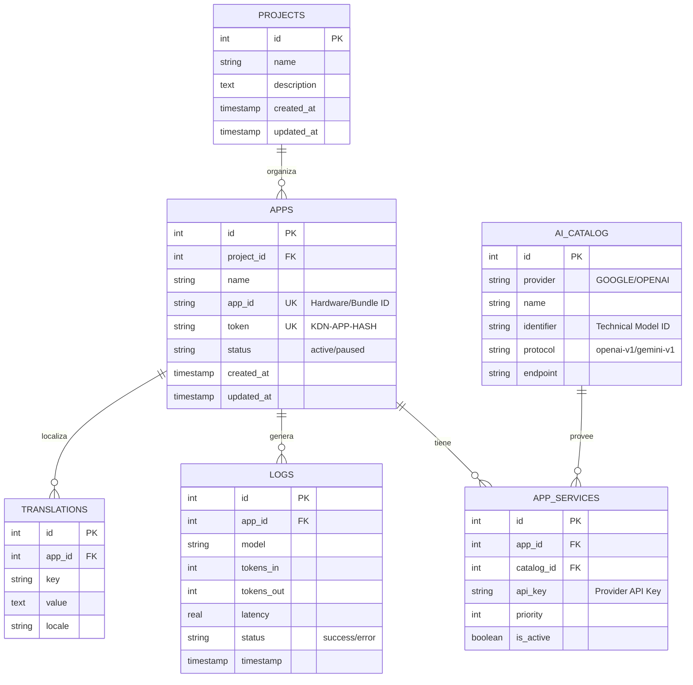

# Database Schema: KODAN-HUB AI Gateway

Este documento detalla la estructura de datos del núcleo de KODAN-HUB, reconstruida mediante análisis estático de modelos Eloquent, queries de Medoo y scripts de migración.

## Entidad-Relación (ERD)

## Diccionario de Datos

### Tabla: `apps`
Almacena las credenciales y el estado de cada aplicación cliente vinculada al HUB.

| Campo | Tipo | Descripción |
| :--- | :--- | :--- |
| `id` | INTEGER | Identificador interno secuencial. |
| `project_id` | INTEGER | Vínculo opcional con la tabla `projects`. |
| `name` | TEXT | Nombre comercial de la aplicación. |
| `app_id` | TEXT | Identificador único del dispositivo o bundle (Hardware ID). |
| `token` | TEXT | Token de acceso `KDN-` usado en los headers. |
| `status` | TEXT | Estado operativo (`active`, `paused`). |

### Tabla: `app_services`
Define qué modelos de IA tiene permitidos usar una aplicación específica y con qué prioridad.

| Campo | Tipo | Descripción |
| :--- | :--- | :--- |
| `app_id` | INTEGER | Relación con la aplicación. |
| `catalog_id`| INTEGER | Relación con el catálogo de modelos. |
| `api_key` | TEXT | Clave de API del proveedor (Gemini/OpenAI). |
| `priority` | INTEGER | Orden de ejecución en caso de fallo (Failover). |

### Tabla: `logs`
Registro de auditoría técnica para monitoreo de costos y latencia.

| Campo | Tipo | Descripción |
| :--- | :--- | :--- |
| `tokens_in` | INTEGER | Conteo de tokens en el prompt enviado. |
| `tokens_out`| INTEGER | Conteo de tokens en la respuesta recibida. |
| `latency` | REAL | Tiempo de ida y vuelta en segundos. |
| `status` | TEXT | Resultado de la operación (`success` o `error`). |
