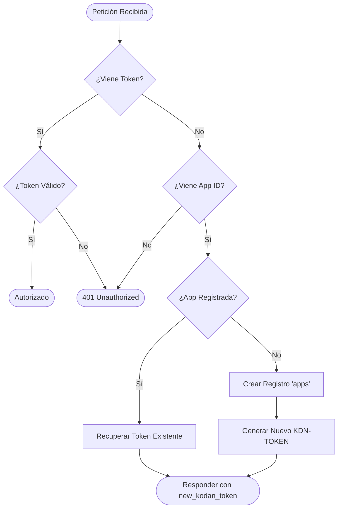
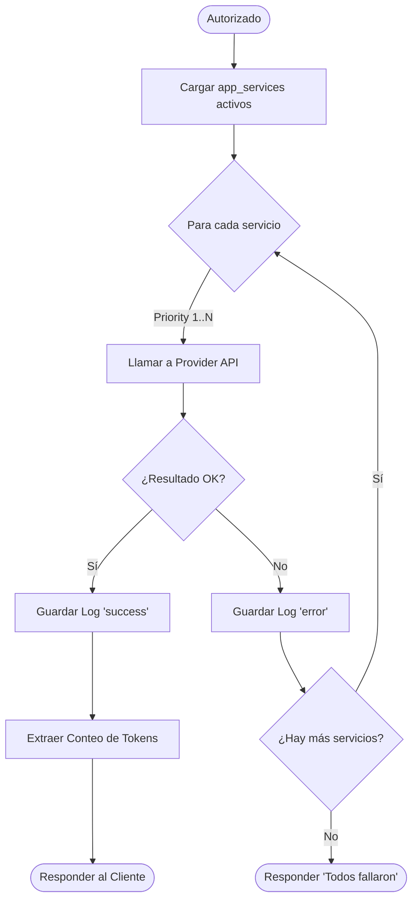

# Logical Flowcharts: KODAN-HUB

Visualización de la lógica de negocio y flujos de decisión del sistema.

## 1. Flujo de Handshake (Autoregistro)

Este proceso ocurre cuando una aplicación cliente se comunica por primera vez o ha perdido su token.

## 2. Ciclo de Ejecución IA (Proxying)

Lógica de selección de servicio y gestión de fallos (Failover).

