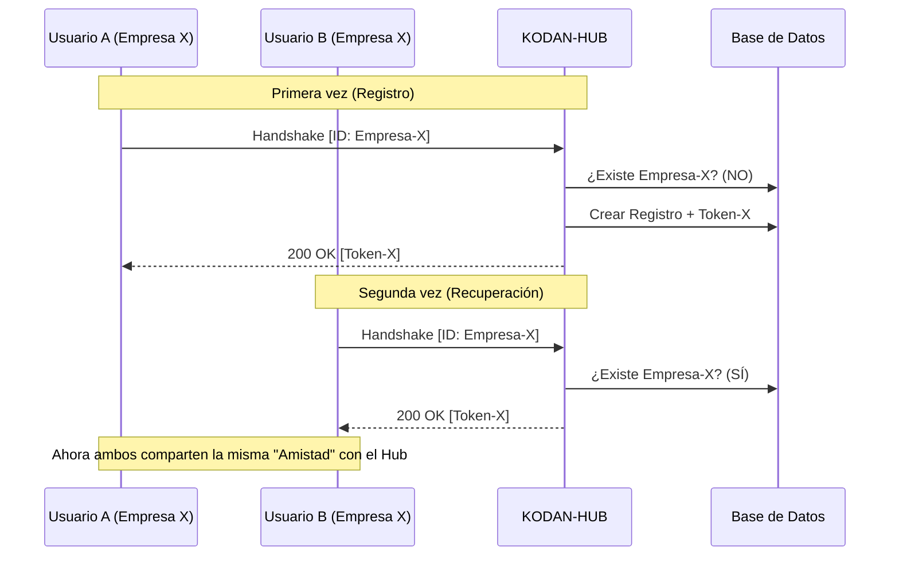

# Handshake e Identidad Compartida: Manual de Integración KodanHUB

Este documento detalla el protocolo de comunicación entre aplicaciones cliente (SmartCook, TimeTracker, etc.) y el **KODAN-HUB AI Gateway**, con especial énfasis en el soporte para cientos de usuarios concurrentes mediante el modelo de **Identidad Compartida**.

---

## 1. Conceptos Fundamentales

### 1.1 El App-ID como Ancla de Identidad y Seguridad
A diferencia de otros sistemas donde cada usuario tiene su propia API Key, en KodanHUB el acceso se gestiona a nivel de **Instancia de Aplicación** o **Tenant (Empresa)**.

-   **X-KODAN-APP-ID**: Es el identificador único y actúa como **llave de registro**.
    -   **Seguridad**: Para evitar suplantaciones, el ID no debe ser genérico (ej: `smartcook-global`). Debe ser una cadena larga y compleja (ej: `SC-MASTER-8DAC5109A1508665`).
    -   **Escalabilidad**: Todos los usuarios de la misma aplicación comparten este ID.
-   **X-KODAN-TOKEN**: Es la llave de sesión generada por el Hub. Una vez obtenida mediante handshake, debe persistirse localmente en el dispositivo.

### 1.2 Handshake Idempotente (Registro y Recuperación)
El handshake es el proceso de "presentación" de una app. Es **idempotente**, lo que permite que una app recupere su token si lo pierde (por ejemplo, al reinstalarse).

---

## 2. Protocolo de Handshake

### Paso 1: Petición de Sincronización
La aplicación debe realizar un `POST` al root del Hub con el cuerpo del mensaje **vacío**.

**Headers Requeridos:**
```http
POST / HTTP/1.1
Host: hub.kodan.software
X-KODAN-APP-ID: [MASTER_ID_COMPLEJO]
X-KODAN-APP-NAME: [NOMBRE_AMIGABLE]
Content-Length: 0
```

### Paso 2: Procesamiento del Hub
El Hub sigue esta lógica interna de forma autónoma:
1.  **¿Existe el ID?**
    -   **NO (Registro)**: Crea un nuevo registro vinculado a ese ID complejo, genera un Token y lo devuelve.
    -   **SÍ (Recuperación)**: Recupera el Token existente del registro y lo devuelve.
2.  **Respuesta JSON:**
```json
{
  "status": "success",
  "new_kodan_token": "KDN-XXXXXXXXXXXXXXXX",
  "message": "Handshake OK"
}
```

---

## 3. Estrategias de Implementación

### 3.1 Modelo de Aplicación Masiva (SmartCook Style)
Ideal para apps móviles donde miles de usuarios comparten una misma cuota de IA.
-   **Seguridad**: El **Master App-ID** complejo se incluye en el código de la App (ofuscado).
-   **Persistencia**: La App realiza el handshake solo la primera vez y guarda el Token en almacenamiento persistente (`AsyncStorage`).
-   **Resiliencia**: Si el Hub invalida el token, la App detecta el error 401 y realiza un re-handshake automático.

### 3.2 Modelo SaaS Multi-tenant (TimeTracker Style)
Ideal para plataformas donde cada cliente (empresa) tiene su propia identidad.
-   **Diferenciación**: Se genera un `App-ID` único y aleatorio por cada Tenant en el momento de su creación.
-   **Aislamiento**: El consumo de "Empresa A" no afecta a "Empresa B", permitiendo auditorías granulares por cliente.

---

## 4. Mejores Prácticas de Seguridad

1.  **Complejidad del ID**: Nunca uses IDs predecibles. La seguridad del handshake autónomo reside en la imposibilidad de adivinar el `App-ID`.
2.  **Persistencia y Performance**: Las apps **nunca** deben hacer handshake en cada llamada. El token debe leerse del almacenamiento local.
3.  **Resiliencia Nivel 2**: Implementar una lógica de auto-limpieza; si el token guardado falla, la app debe intentar sincronizarse de nuevo automáticamente antes de reportar error al usuario.
4.  **Cero Hardcode de Tokens**: Nunca grabes el `X-KODAN-TOKEN` directamente en el código; deja que el Handshake lo gestione dinámicamente.

---

## 5. Diagrama de Secuencia (Escalado)


