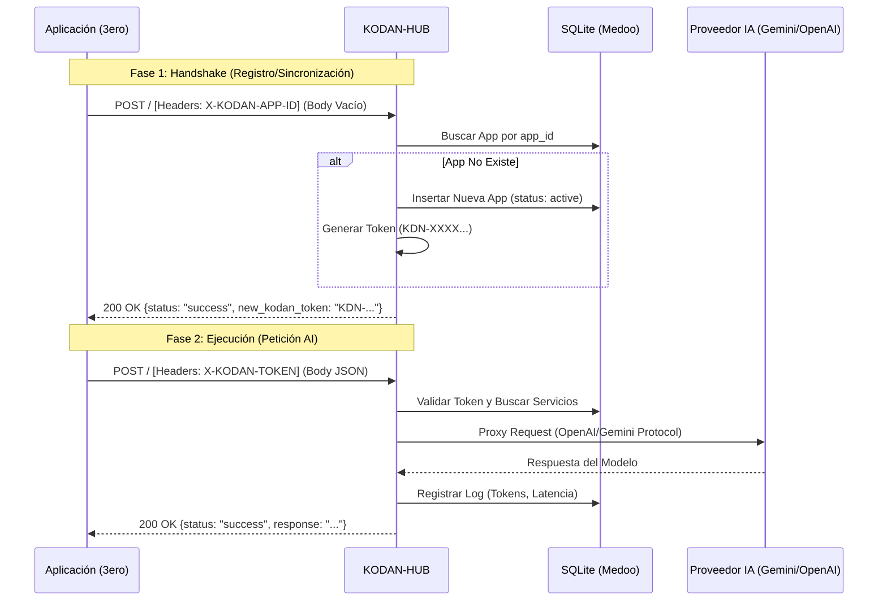

# Análisis del Flujo de Handshake y Firmas: KODAN-HUB AI Gateway

El sistema KODAN-HUB implementa un mecanismo de **Handshake Automático** diseñado para facilitar la integración de aplicaciones de terceros (3eros) sin intervención manual previa en la base de datos. Este proceso se basa en la identificación por `App-ID` y el intercambio de un `Token` de sesión permanente.

## 1. Protocolo de Comunicación
- **Endpoint:** `https://hub.kodan.software/index.php` (o el host correspondiente).
- **Método:** `POST` (Obligatorio).
- **Formato:** `application/json`.
- **Headers Requeridos:**
  - `X-KODAN-APP-ID`: Identificador único de la aplicación cliente.
  - `X-KODAN-APP-NAME`: (Opcional) Nombre descriptivo de la aplicación.
  - `X-KODAN-TOKEN`: Token devuelto por el hub (requerido tras el handshake).

---

## 2. Flujo de Handshake (Diagrama Mermaid)



---

## 3. Guía de Uso Práctico para 3eros

### Paso 1: Realizar el Handshake Inicial
Para obtener su token de acceso, la aplicación debe presentarse ante el Hub. El secreto de este flujo es enviar los headers **sin cuerpo de mensaje (body)**.

**Ejemplo en cURL:**
```bash
curl -X POST https://hub.kodan.software/ \
     -H "X-KODAN-APP-ID: APP-TRACKER-V2" \
     -H "X-KODAN-APP-NAME: Time Tracker Production"
```

**Respuesta Esperada:**
```json
{
  "status": "success",
  "new_kodan_token": "KDN-A1B2C3D4E5F6G7H8",
  "message": "Handshake OK"
}
```
> [!IMPORTANT]
> **Idempotencia y Multi-usuario:** El Hub permite que múltiples instancias de una misma aplicación (ej: todos los empleados de una empresa o todos los usuarios de una App global) obtengan el mismo token. Si una app ya existe con el `X-KODAN-APP-ID` proveído, el Hub devolverá el token existente en lugar de crear uno nuevo.
> El cliente debe persistir este `new_kodan_token` localmente, pero puede volver a pedirlo realizando un handshake si lo pierde.

### Paso 2: Consumir el Servicio de IA
Una vez obtenido el token, todas las peticiones deben incluirlo y enviar el payload con la acción `ai`.

**Ejemplo en cURL:**
```bash
curl -X POST https://hub.kodan.software/ \
     -H "X-KODAN-TOKEN: KDN-A1B2C3D4E5F6G7H8" \
     -H "Content-Type: application/json" \
     -d '{
           "action": "ai",
           "payload": {
             "messages": [
               {"role": "user", "content": "Analiza este reporte de tiempos..."}
             ],
             "temperature": 0.5
           }
         }'
```

---

## 4. Auditoría Técnica de Seguridad

1.  **Validación de Origen (CORS):** El Hub valida estrictamente que el origin pertenezca a `*.kodan.software`.
2.  **Complejidad de Registro:** La seguridad del handshake autónomo se basa en el **App-ID Impredecible**. Solo quien conozca el ID secreto puede registrarse o recuperar el token.
3.  **Aislamiento de Aplicaciones:** Las aplicaciones solo pueden acceder a los servicios de IA que el administrador del Hub les asigne en la tabla `app_services`.
4.  **Resiliencia de Cliente (Nivel 2):** Se recomienda que el cliente implemente una lógica de auto-sincronización; si recibe un error de autenticación, debe invalidar su caché local y re-intentar el handshake.

---

## 5. Recomendación de Implementación (Antigravity Standard)

> [!TIP]
> **Identidad Segura en Mobile:** Para apps masivas como SmartCook, utiliza un ID que combine un prefijo de marca con un hash único (ej: `KDN-SC-PROD-9A2F...`). Evita IDs genéricos para prevenir ataques de suplantación durante la fase de registro inicial.
