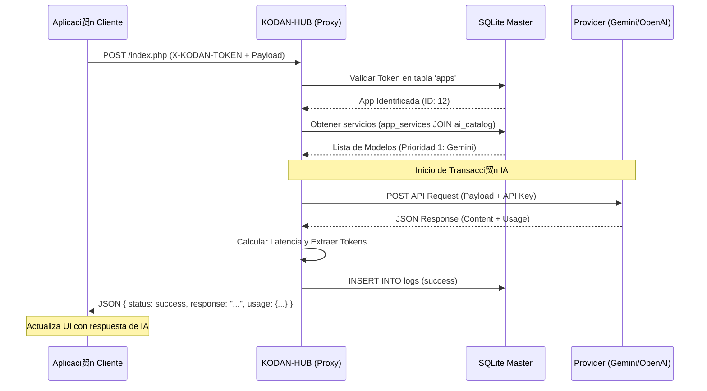
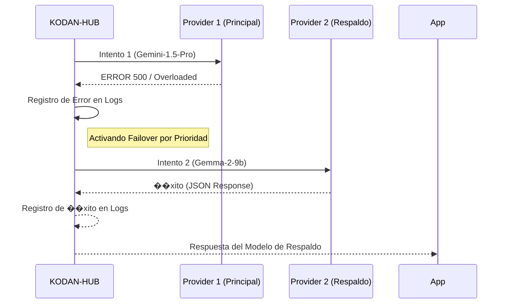

# Sequence Diagrams: Protocolo KODAN-Sync

Interacci贸n entre actores del ecosistema KODAN.

## Transacci贸n de IA Exitosa

Muestra el flujo est谩ndar de una consulta desde que sale de la App cliente hasta que retorna la respuesta procesada.

## Flujo de Failover (Recuperaci贸n ante Fallos)

Muestra el comportamiento del sistema cuando el proveedor principal falla y se activa el secundario.

## Handshake Idempotente (Auto-Onboarding & Shared Identity)

Flujo utilizado para registro inicial o recuperaci�n de tokens en despliegues multi-usuario.

`mermaid
sequenceDiagram
    participant App as App (Cualquier Instancia)
    participant Hub as KODAN-HUB
    participant DB as SQLite Master

    App->>Hub: POST / [Headers: X-KODAN-APP-ID] (Body Vac�o)
    Hub->>DB: SELECT * FROM apps WHERE app_id = ?
    
    alt Registro Nuevo
        DB-->>Hub: NULL
        Hub->>DB: INSERT INTO apps (ID, Token, Status)
        Hub-->>App: 200 OK { new_kodan_token: " KDN-NEW\, message: \Registrado\ }
 else Recuperaci�n (Shared Identity)
 DB-->>Hub: App Record (Token: KDN-EXISTING)
 Hub-->>App: 200 OK { new_kodan_token: \KDN-EXISTING\, message: \Sincronizado\ }
 end
`
