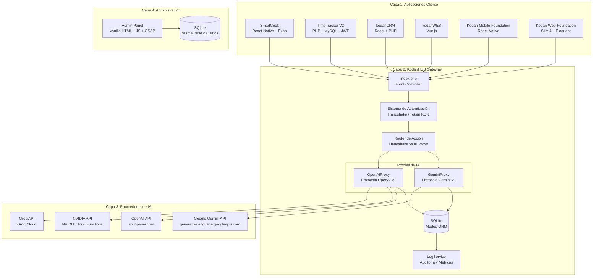
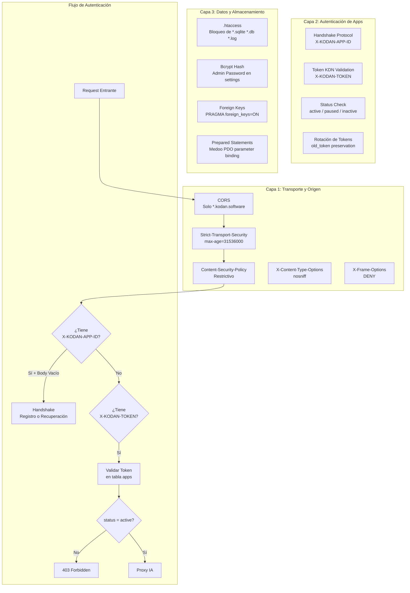
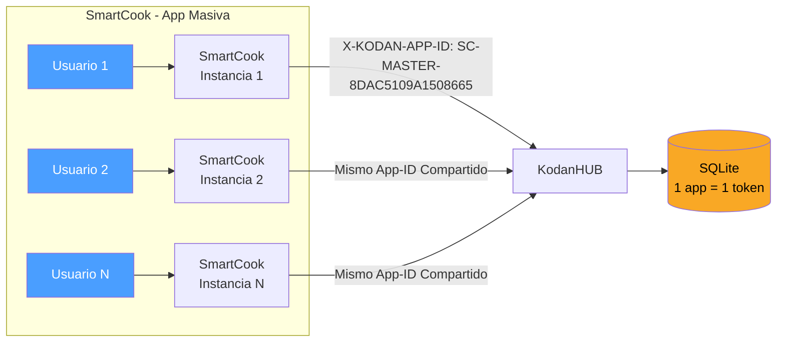
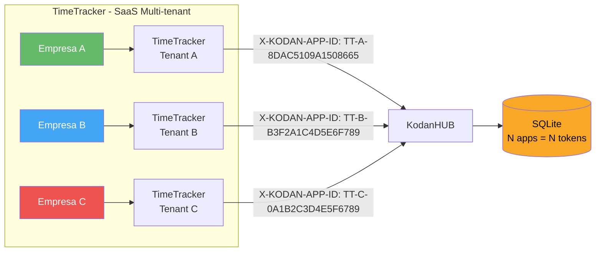
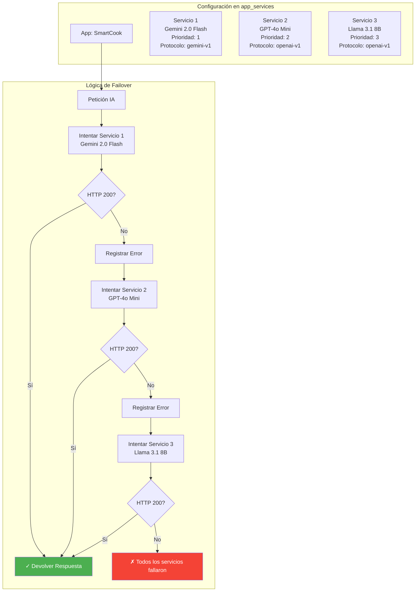
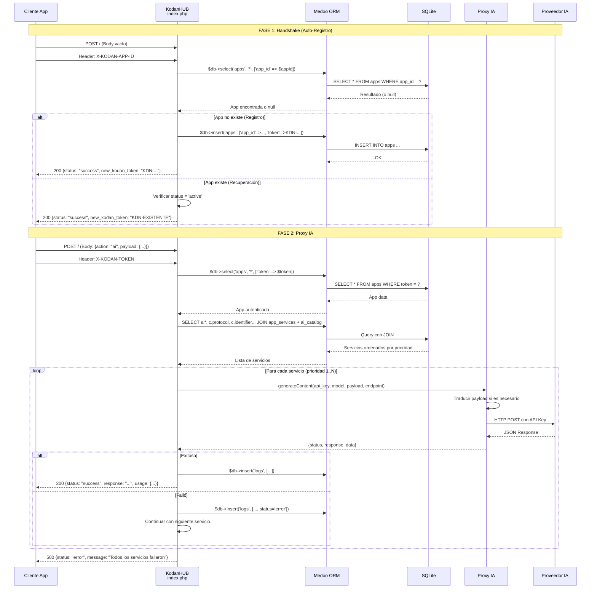

# White Paper 01: Arquitectura Técnica de KodanHUB

> **KodanHUB — AI Gateway Centralizado**
> Versión: 1.0.49 | Clasificación: Interno / White Paper
> Fecha: 2026-05-26

---

## Resumen Ejecutivo

KodanHUB es un **AI Gateway** centralizado que actúa como intermediario entre aplicaciones cliente (SmartCook, TimeTracker, kodanCRM, kodanWEB) y múltiples proveedores de Inteligencia Artificial (Google Gemini, OpenAI, NVIDIA, Groq). Su arquitectura sigue el patrón **Proxy-Pass**: las aplicaciones nunca poseen directamente API Keys de proveedores de IA, eliminando el riesgo de exposición de credenciales en dispositivos cliente.

El sistema implementa un protocolo de **Handshake Autónomo** para auto-registro de aplicaciones, un **sistema de Failover** por prioridad entre modelos de IA, y **traducción bidireccional de protocolos** entre los formatos OpenAI (`messages`) y Gemini (`contents`).

---

## 1. Arquitectura General



**Figura 1.1** — Arquitectura en 4 capas: Clientes, Gateway, Proveedores, Administración.

---

## 2. Stack Tecnológico

| Capa | Tecnología | Versión | Propósito |
|------|-----------|---------|-----------|
| **Lenguaje** | PHP | >= 8.0 | Motor principal del Gateway |
| **Base de Datos** | SQLite 3 | v3.x | Persistencia portable (sin servidor) |
| **ORM** | Medoo (custom) | 2.1 | Wrapper PDO con prepared statements |
| **HTTP Client** | cURL | nativo | Comunicación con APIs de IA |
| **Admin CSS** | Glassmorphism | custom | Tema oscuro con acentos neón |
| **Admin JS** | GSAP 3.12 + Lucide Icons | 3.12 | Animaciones e iconografía |
| **Dependencias** | catfan/medoo, vlucas/phpdotenv, nesbot/carbon | Composer | Soporte adicional |
| **Deploy** | PowerShell + cPanel | - | Script automatizado |

### 2.1 Justificación Técnica

**SQLite** fue elegido sobre MySQL/PostgreSQL por:
- **Portabilidad**: Base de datos autocontenida en un archivo (`hub.sqlite` ~2MB)
- **Cero configuración**: No requiere demonio de base de datos
- **Rendimiento**: Óptimo para el volumen esperado (cientos de apps, miles de logs/día)
- **Deploy simple**: Un solo archivo se copia con el resto del proyecto

**Medoo custom** reemplaza a Eloquent por:
- **Ligereza**: ~100 líneas vs Eloquent + Illuminate (~100+ archivos)
- **Prepared Statements**: Seguridad contra SQL injection nativa
- **API fluida**: `$db->select()`, `$db->insert()`, `$db->update()`, `$db->delete()`

---

## 3. Modelo de Seguridad en 3 Capas



**Figura 3.1** — Arquitectura de seguridad en 3 capas con flujo de autenticación.

### 3.1 Encabezados de Seguridad (HTTP Response Headers)

```
Content-Type:          application/json; charset=UTF-8
Access-Control-Allow-Origin: (regex: ^https?:\/\/(.*\.?kodan\.software)$)
Access-Control-Allow-Methods: POST, OPTIONS
Access-Control-Allow-Headers: Content-Type, X-KODAN-TOKEN, X-KODAN-APP-ID, Authorization
X-Content-Type-Options: nosniff
X-Frame-Options:       DENY
Strict-Transport-Security: max-age=31536000; includeSubDomains
Content-Security-Policy: default-src 'self'; script-src 'self'; connect-src 'self' https://*.googleapis.com https://api.openai.com;
```

### 3.2 Hardening de Base de Datos (`.htaccess`)

```apache
<FilesMatch "\.(sqlite|db|log)$|^config\.php$|^\.env$|^logs/.*">
    Order Allow,Deny
    Deny from all
</FilesMatch>
```

---

## 4. Sistema de Tokens KDN

### 4.1 Formato y Algoritmo de Generación

KodanHUB **no utiliza JWT**. Implementa un sistema de tokens propio llamado **KDN Token**, diseñado para simplicidad y operación sin estado compartido.

```
Formato: KDN-[PREFIX]-[16-CHAR HEX HASH]
Ejemplo: KDN-SC-8DAC5109A1508665
         KDN-TT-B3F2A1C4D5E6F789
         KDN-CRM-0A1B2C3D4E5F6789
```

**Algoritmo de generación** (`generateKodanToken` en `admin/actions.php`):

```php
function generateKodanToken($name) {
    // 1. Limpiar nombre
    $cleanName = preg_replace('/[^A-Za-z0-9 ]/', '', $name);
    $words = explode(' ', $cleanName);
    
    // 2. Generar prefijo de iniciales
    $prefix = '';
    if (count($words) > 1) {
        foreach ($words as $w) {
            $prefix .= strtoupper(substr($w, 0, 1));
        }
    } else {
        $prefix = strtoupper(substr($cleanName, 0, 2));
    }
    
    // 3. Hash criptográfico con uniqid + md5
    return 'KDN-' . $prefix . '-' . strtoupper(substr(md5(uniqid()), 0, 6));
}
```

### 4.2 Modelo de Confianza

| Propiedad | Descripción |
|-----------|-------------|
| **Formato** | `KDN-[PREFIX]-[HASH]` — sin claims, sin payload, sin expiry |
| **Storage** | Persistido en SQLite (`apps.token`), validado contra DB |
| **Rotación** | Soporte nativo: `old_token` preserva el anterior durante transición |
| **ID vs Token** | `X-KODAN-APP-ID` = llave de registro (secreto pre-compartido). `X-KODAN-TOKEN` = llave de sesión (generada por Hub) |
| **Seguridad** | Basada en impredictibilidad del App-ID. No recomendado para escenarios de alta seguridad sin HTTPS |

**Contraste con JWT:**

| Aspecto | KDN Token | JWT (Estándar) |
|---------|-----------|----------------|
| **Formato** | Opaco (hash) | JSON codificado Base64URL |
| **Claims** | Ninguno | `sub`, `iat`, `exp`, `iss`, etc. |
| **Expiración** | No expira (manual) | `exp` claim |
| **Validación** | Consulta a DB (I/O) | Firma asimétrica/simétrica (sin I/O) |
| **Revocación** | Cambio en DB | Blacklist o expiry corto |
| **Uso en KodanHUB** | AI Gateway | Apps del ecosistema como TimeTracker |

### 4.3 Flujo de Rotación de Tokens

```
Estado Actual:
  apps.token = KDN-SC-A1B2C3
  apps.old_token = null

Paso 1: Admin hace clic en "Rotar Token"
Paso 2: Sistema genera nuevo token: KDN-SC-D4E5F6
Paso 3: UPDATE apps SET old_token = 'KDN-SC-A1B2C3', token = 'KDN-SC-D4E5F6'
Paso 4: (Opcional) Mailer envía alerta de rotación
Paso 5: App cliente recibe 401, hace re-handshake, obtiene nuevo token

Nota: old_token permite depuración forense. No se usa para validación dual.
```

---

## 5. Modelos de Despliegue

### 5.1 Mass App (Identidad Compartida)



**Características:**
- Todas las instancias comparten el mismo App-ID y Token
- Una sola cuota de IA para toda la base de usuarios
- App-ID ofuscado en el código de la app móvil
- Ideal para apps B2C masivas

### 5.2 SaaS Multi-tenant (Identidad Aislada)



**Características:**
- Cada tenant tiene su propio App-ID y Token único
- Consumo aislado: auditoría granular por cliente
- App-ID generado aleatoriamente al crear el tenant
- Ideal para plataformas B2B

---

## 6. Traducción de Protocolo (Gemini vs OpenAI)

KodanHUB implementa **traducción bidireccional** entre los dos formatos de payload más utilizados en la industria de IA.

### 6.1 Mapeo de Campos

| Concepto | OpenAI (messages) | Gemini (contents) | Traducción |
|----------|------------------|-------------------|------------|
| **Roles** | `system`, `user`, `assistant` | `user`, `model` | `assistant` → `model` / `model` → `assistant` |
| **Contenido texto** | `content`: string | `parts[].text` | Directo |
| **Imágenes** | `content`: [{type: image_url, image_url: {url}}] | `parts[].inlineData` | Conversión base64 ↔ URL data |
| **Temperatura** | `temperature` | `generationConfig.temperature` | Mapeo directo |
| **Max tokens** | `max_tokens` | `generationConfig.maxOutputTokens` | Mapeo directo |
| **Uso de tokens** | `usage.prompt_tokens`, `usage.completion_tokens` | `usageMetadata.promptTokenCount`, `usageMetadata.candidatesTokenCount` | Extracción estandarizada |

### 6.2 Traducción OpenAI → Gemini (GeminiProxy.php)

```php
// Entrada (formato OpenAI):
$payload = [
    'messages' => [
        ['role' => 'user', 'content' => 'Hola'],
        ['role' => 'assistant', 'content' => '¿Cómo estás?']
    ],
    'temperature' => 0.5,
    'max_tokens' => 4096
];

// Salida (formato Gemini):
$geminiPayload = [
    'contents' => [
        ['role' => 'user', 'parts' => [['text' => 'Hola']]],
        ['role' => 'model', 'parts' => [['text' => '¿Cómo estás?']]]
    ],
    'generationConfig' => [
        'temperature' => 0.5,
        'maxOutputTokens' => 4096
    ]
];
```

### 6.3 Traducción Gemini → OpenAI (OpenAIProxy.php)

```php
// Entrada (formato Gemini):
$payload = [
    'contents' => [
        ['role' => 'user', 'parts' => [['text' => 'Analiza esta imagen', 'inlineData' => ['mimeType' => 'image/jpeg', 'data' => 'base64...']]]]
    ],
    'generationConfig' => ['temperature' => 0.7, 'maxOutputTokens' => 4096]
];

// Salida (formato OpenAI):
$openAiPayload = [
    'model' => 'llama-3.1-8b',
    'messages' => [
        ['role' => 'user', 'content' => [
            ['type' => 'text', 'text' => 'Analiza esta imagen'],
            ['type' => 'image_url', 'image_url' => ['url' => 'data:image/jpeg;base64,...']]
        ]]
    ],
    'temperature' => 0.7,
    'max_tokens' => 4096
];
```

### 6.4 Manejo de Imágenes (Base64 Inline)

```mermaid
flowchart LR
    subgraph "Entrada desde App Cliente"
        IMG[Imagen capturada por cámara]
        B64[Base64 Encoding]
        PAYLOAD[messages: [{type: image_url, image_url: {url: data:image/jpeg;base64,...}}]]
        IMG --> B64 --> PAYLOAD
    end

    subgraph "KodanHUB Traducción"
        REGEX[Regex: data:image/[a-zA-Z]*;base64,]
        EXTRACT[Extraer mimeType y data]
        BUILD[Construir parts[].inlineData]
        PAYLOAD --> REGEX --> EXTRACT --> BUILD
    end

    subgraph "Salida a Gemini"
        GEMINI[contents: [{parts: [{inlineData: {mimeType: image/jpeg, data: base64...}}]}]]
        BUILD --> GEMINI
    end
```

---

## 7. Sistema de Failover



**Figura 7.1** — Estrategia de failover con 3 servicios en cascada por prioridad.

### 7.1 Algoritmo de Failover

```php
$services = $db->query("
    SELECT s.*, c.protocol, c.identifier, c.endpoint, c.provider 
    FROM app_services s 
    JOIN ai_catalog c ON s.catalog_id = c.id 
    WHERE s.app_id = ? AND s.is_active = 1 
    ORDER BY s.priority ASC
", [$app['id']])->fetchAll();

foreach ($services as $service) {
    $startTime = microtime(true);
    
    if ($service['protocol'] === 'openai-v1') {
        $result = OpenAIProxy::generateContent($service['api_key'], $service['identifier'], $payload, $service['endpoint']);
    } else {
        $result = GeminiProxy::generateContent($service['api_key'], $service['identifier'], $payload, $service['endpoint']);
    }
    
    $latency = round(microtime(true) - $startTime, 2);
    
    if ($result['status'] === 'success') {
        // ✅ Éxito: loguear y responder inmediatamente
        LogService::save($app['id'], $service['identifier'], $tokens[0], $tokens[1], $latency, 'success');
        echo json_encode(['status' => 'success', ...]);
        exit;
    } else {
        // ❌ Error: loguear y continuar con el siguiente
        LogService::save($app['id'], $service['identifier'], 0, 0, $latency, 'error');
    }
}

// Todos fallaron
echo json_encode(['status' => 'error', 'message' => 'Todos los servicios de IA fallaron.']);
```

---

## 8. Auditoría y Logging

### 8.1 Estructura del Log

Cada transacción de IA registra:

| Campo | Tipo | Ejemplo |
|-------|------|---------|
| `app_id` | INTEGER FK | 12 |
| `model` | TEXT | `gemini-2.0-flash` |
| `tokens_in` | INTEGER | 450 |
| `tokens_out` | INTEGER | 1230 |
| `latency` | REAL | 3.45 (segundos) |
| `status` | TEXT | `success` / `error` |
| `timestamp` | TIMESTAMP | `2026-05-26 14:30:00` |

### 8.2 Dashboard de Métricas

El panel de administración expone:
- **Tokens totales**: Suma acumulada de `tokens_in + tokens_out`
- **Requests totales**: Conteo de transacciones
- **Apps activas**: Conteo de apps con `status = 'active'`
- **Requests última hora**: Ventana de tiempo para monitoreo en vivo
- **Tasa de error**: Porcentaje de `status = 'error'`
- **Latencia promedio**: Media aritmética de latencia por período
- **Eficiencia**: Ratio de éxito vs total de requests

---

## 9. Flujo Completo de una Transacción



---

## 10. Referencia de Seguridad

### 10.1 Checklist de Seguridad

- [x] **CORS restrictivo**: Solo `*.kodan.software`
- [x] **HSTS forzado**: `max-age=31536000; includeSubDomains`
- [x] **CSP estricto**: `default-src 'self'`
- [x] **X-Frame-Options**: `DENY` (previene clickjacking)
- [x] **X-Content-Type-Options**: `nosniff`
- [x] **SQLite protegido**: `.htaccess` bloquea acceso directo
- [x] **Prepared Statements**: Medoo usa PDO parameter binding
- [x] **API Keys cifradas en tránsito**: HTTPS obligatorio
- [ ] **API Keys cifradas en reposo**: Pendiente (almacenadas en texto plano en `app_services.api_key`)
- [ ] **Token expiry automático**: Pendiente (rotación manual vía admin)
- [ ] **Rate limiting**: Pendiente (no implementado en v1.0.49)
- [ ] **Mailer de alertas**: Pendiente (clase `Mailer` stubbed)

### 10.2 Vulnerabilidades Conocidas y Mitigaciones

| ID | Vulnerabilidad | Impacto | Mitigación |
|:--:|---------------|---------|------------|
| V-001 | `CURLOPT_SSL_VERIFYPEER = false` | Man-in-the-Middle | Intencional para compatibilidad con cPanel. Mitigado por HSTS a nivel de servidor |
| V-002 | API Keys en texto plano en DB | Exposición si DB es comprometida | Se requiere cifrado simétrico (AES-256) pendiente para v2.0 |
| V-003 | Sin rate limiting | Abuso de API | Pendiente. Se recomienda implementar middleware de throttling |
| V-004 | Token sin expiry | Token robado es válido indefinidamente | Mitigado por rotación manual y monitoreo de logs |
| V-005 | SQLite sin cifrado | Acceso físico al archivo | Mitigado por `.htaccess`. Se recomienda SQLite Encryption Extension (SEE) para alta seguridad |

---

## Referencias

- Código fuente: `index.php`, `src/Services/GeminiProxy.php`, `src/Services/OpenAIProxy.php`, `src/Services/LogService.php`
- Documentación de base de datos: `docs/database_schema.md`
- Flujo de handshake: `docs/handshake_signature_flow.md`
- Modelo de identidad compartida: `docs/handshake_shared_identity.md`
- [Medoo PHP Framework](https://medoo.in/)
- [PHP PDO Prepared Statements](https://www.php.net/manual/en/pdo.prepared-statements.php)

---

> **Fin de White Paper 01** — Próximo documento: White Paper 02 - Diagramas de Flujo
