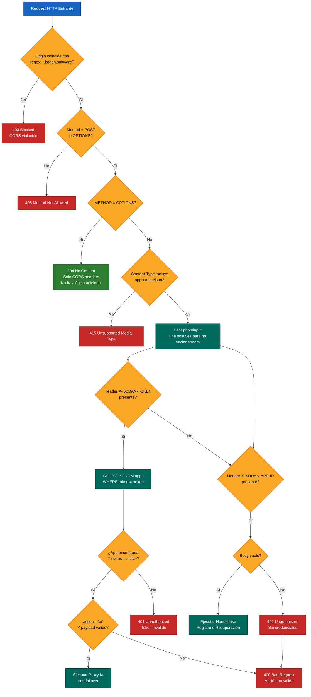
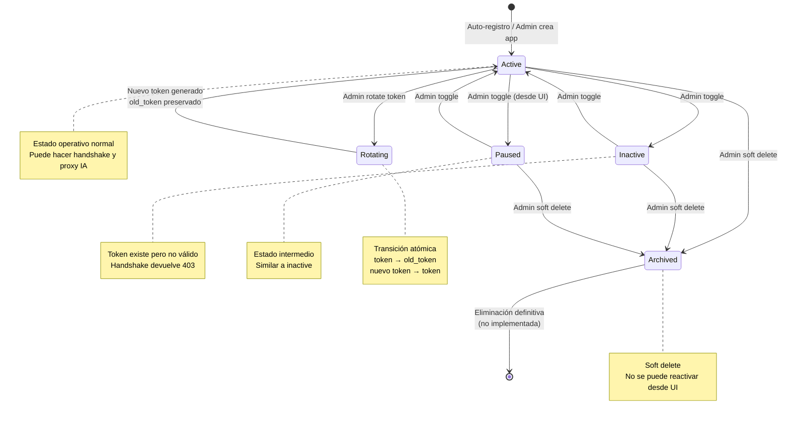
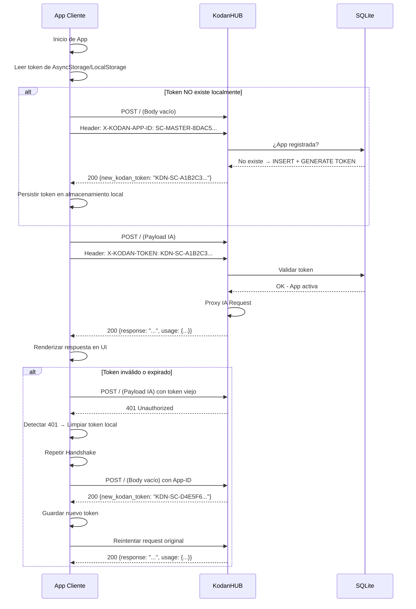

# White Paper 02: Diagramas de Flujo de KodanHUB

> **KodanHUB — AI Gateway Centralizado**
> Versión: 1.0.49 | Clasificación: Interno / White Paper
> Fecha: 2026-05-26

---

## 1. Flujo de Handshake (Auto-Registro y Recuperación de Token)

El handshake es el mecanismo de **auto-onboarding** que permite a cualquier aplicación cliente registrarse sin intervención administrativa. La seguridad se basa en la impredictibilidad del `X-KODAN-APP-ID`.

```mermaid
flowchart TB
    %% Estilos
    classDef inicio fill:#1565c0,color:#fff,stroke:#0d47a1,stroke-width:2px
    classDef decision fill:#f9a825,color:#000,stroke:#f57f17,stroke-width:2px
    classDef proceso fill:#2e7d32,color:#fff,stroke:#1b5e20,stroke-width:2px
    classDef error fill:#c62828,color:#fff,stroke:#b71c1c,stroke-width:2px
    classDef fin fill:#4a148c,color:#fff,stroke:#38006b,stroke-width:2px

    INICIO([Petición POST recibida]):::inicio
    BODY_CHECK{¿Body vacío?}:::decision
    
    BODY_EMPTY[Sí: Flujo de Handshake]:::proceso
    BODY_HAS[No: Verificar autenticación]:::proceso
    
    APP_ID_CHECK{¿Header X-KODAN-APP-ID<br/>presente?}:::decision
    
    APP_ID_MISS[401 Unauthorized<br/>Error: App ID requerido]:::error
    
    DB_CHECK{¿App registrada<br/>en SQLite?}:::decision
    
    DB_YES[[Registro existe]]:::proceso
    DB_NO[[Registro NO existe]]:::proceso
    
    STATUS_CHECK{¿status = active?}:::decision
    
    STATUS_INACTIVE[403 Forbidden<br/>App inactiva o pausada<br/>Código: ERR-APP-PAUSED]:::error
    
    RECOVER[Recuperar token existente<br/>de apps.token]:::proceso
    
    REGISTER[Crear nuevo registro en apps<br/>app_id, name, status=active]:::proceso
    GEN_TOKEN[Generar KDN token<br/>KDN-PREFIX-MD5_HASH<br/>Ej: KDN-SC-8DAC5109A1508665]:::proceso
    GEN_TOKEN --> STORE[Persistir token en SQLite<br/>apps.token = new_token]:::proceso
    
    RESPOND_200[200 OK<br/>{status: success,<br/>new_kodan_token: KDN-...,<br/>message: Handshake OK}]:::fin
    
    APP_RETURN[App cliente persiste token<br/>en almacenamiento local<br/>AsyncStorage / LocalStorage]:::proceso

    %% Conexiones
    INICIO --> BODY_CHECK
    BODY_CHECK -->|Sí| BODY_EMPTY
    BODY_CHECK -->|No| BODY_HAS
    
    BODY_EMPTY --> APP_ID_CHECK
    APP_ID_CHECK -->|No| APP_ID_MISS
    APP_ID_CHECK -->|Sí| DB_CHECK
    
    DB_CHECK -->|Sí| DB_YES
    DB_CHECK -->|No| DB_NO
    
    DB_YES --> STATUS_CHECK
    STATUS_CHECK -->|No = inactive/paused/archived| STATUS_INACTIVE
    STATUS_CHECK -->|Sí = active| RECOVER
    
    DB_NO --> REGISTER
    REGISTER --> GEN_TOKEN
    GEN_TOKEN --> STORE
    
    RECOVER --> RESPOND_200
    STORE --> RESPOND_200
    
    RESPOND_200 --> APP_RETURN
    
    %% Notas
    note1(("NOTA: Handshake IDEMPOTENTE<br/>Multiples instancias de la misma app<br/>reciben el MISMO token"))
    note2(("NOTA: El App-ID debe ser<br/>una cadena COMPLEJA impredecible<br/>Ej: SC-MASTER-8DAC5109A1508665"))
    
    note1 --> DB_CHECK
    note2 -.-> APP_ID_CHECK
```

**Figura 1.1** — Flujo completo de handshake con auto-registro y recuperación.

### Pseudocódigo del Handshake

```
HANDLE_REQUEST(request):
    headers = getallheaders()
    appId = headers['X-KODAN-APP-ID']
    inputRaw = request.body
    
    IF appId present AND inputRaw EMPTY:
        app = SELECT * FROM apps WHERE app_id = appId
        
        IF app NOT found:
            // AUTO-REGISTRO
            newToken = 'KDN-' + PREFIX + '-' + MD5(UNIQID())[0:16]
            INSERT INTO apps (app_id, name, token, status)
            RETURN {status: "success", new_kodan_token: newToken, message: "Registrado"}
        ELSE:
            // RECUPERACION
            IF app.status != 'active':
                RETURN 403 {status: "error", message: "App inactiva"}
            RETURN {status: "success", new_kodan_token: app.token, message: "Sincronizado"}
    END IF
```

---

## 2. Ciclo Completo de Proxy IA con Failover

```mermaid
flowchart TB
    %% Estilos
    classDef inicio fill:#1565c0,color:#fff,stroke:#0d47a1,stroke-width:2px
    classDef proceso fill:#2e7d32,color:#fff,stroke:#1b5e20,stroke-width:2px
    classDef decision fill:#f9a825,color:#000,stroke:#f57f17,stroke-width:2px
    classDef error fill:#c62828,color:#fff,stroke:#b71c1c,stroke-width:2px
    classDef fin fill:#4a148c,color:#fff,stroke:#38006b,stroke-width:2px
    classDef proxy fill:#00695c,color:#fff,stroke:#004d40,stroke-width:2px
    classDef auditoria fill:#e65100,color:#fff,stroke:#bf360c,stroke-width:2px

    AUTH_OK([App Autenticada<br/>Token Válido + Status Active]):::inicio
    
    PARSE_BODY[Parsear JSON body<br/>Extraer action y payload]:::proceso
    
    ACTION_CHECK{action = 'ai'<br/>Y payload no vacío?}:::decision
    
    INVALID_ACTION[400 Bad Request<br/>Acción IA no válida]:::error
    
    LOAD_SERVICES[Cargar servicios de la app<br/>SELECT + JOIN app_services + ai_catalog<br/>WHERE is_active = 1<br/>ORDER BY priority ASC]:::proceso
    
    NO_SERVICES[400 Bad Request<br/>App sin servicios configurados<br/>Código: ERR-NO-SERVICES]:::error
    
    SERV_LIST[Lista de servicios<br/>Ej: [Gemini, GPT-4o, Llama]]:::proceso
    
    LOOP_START[Iniciar iteración<br/>por prioridad 1..N]:::proceso
    
    SERVICE_LOAD[Cargar servicio actual<br/>protocol, api_key, identifier, endpoint]:::proceso
    
    PROTO_CHECK{protocol = ?}:::decision
    
    PROTO_OPENAI[Usar OpenAIProxy<br/>generateContent]:::proxy
    PROTO_GEMINI[Usar GeminiProxy<br/>generateContent]:::proxy
    
    TRADUCCION_OPENAI[Traducción Gemini → OpenAI<br/>Si payload trae 'contents'<br/>convertir a 'messages']:::proxy
    TRADUCCION_GEMINI[Traducción OpenAI → Gemini<br/>Si payload trae 'messages'<br/>convertir a 'contents']:::proxy
    
    EXECUTE[Ejecutar cURL request<br/>al endpoint del proveedor<br/>con API Key y payload traducido]:::proceso
    
    LATENCY_CALC[Calcular latencia<br/>microtime(true) - startTime]:::proceso
    
    HTTP_CHECK{HTTP Status = 200<br/>Y response no vacío?}:::decision
    
    EXTRACT_TOKENS[Extraer conteo de tokens<br/>según protocolo:<br/>OpenAI: usage.prompt/completion_tokens<br/>Gemini: usageMetadata.*TokenCount]:::proceso
    
    LOG_SUCCESS[INSERT INTO logs<br/>app_id, model, tokens_in,<br/>tokens_out, latency, status=success]:::auditoria
    
    BUILD_RESPONSE[Construir respuesta JSON<br/>{status: success, response: texto,<br/>usage: {prompt, completion, total},<br/>hub_model, provider}]:::proceso
    
    RESPOND_CLIENT[200 OK<br/>Respuesta al cliente]:::fin
    
    LOG_ERROR[INSERT INTO logs<br/>app_id, model, tokens_in=0,<br/>tokens_out=0, latency, status=error]:::auditoria
    
    HAS_MORE{¿Hay más servicios<br/>en la lista?}:::decision
    
    ALL_FAILED[500 Internal Server Error<br/>{status: error,<br/>message: Todos los servicios fallaron}]:::error
    EXCEPTION[Exception Handler<br/>500 Error Crítico del Hub<br/>{status: error, message, file, line}]:::error

    %% Conexiones
    AUTH_OK --> PARSE_BODY
    PARSE_BODY --> ACTION_CHECK
    ACTION_CHECK -->|No| INVALID_ACTION
    ACTION_CHECK -->|Sí| LOAD_SERVICES
    LOAD_SERVICES --> NO_SERVICES
    LOAD_SERVICES --> SERV_LIST
    
    SERV_LIST --> LOOP_START
    LOOP_START --> SERVICE_LOAD
    
    SERVICE_LOAD --> PROTO_CHECK
    PROTO_CHECK -->|openai-v1| PROTO_OPENAI
    PROTO_CHECK -->|gemini-v1| PROTO_GEMINI
    PROTO_CHECK -->|default| PROTO_GEMINI
    
    PROTO_OPENAI --> TRADUCCION_OPENAI --> EXECUTE
    PROTO_GEMINI --> TRADUCCION_GEMINI --> EXECUTE
    
    EXECUTE --> LATENCY_CALC
    LATENCY_CALC --> HTTP_CHECK
    
    HTTP_CHECK -->|Sí: Éxito| EXTRACT_TOKENS
    EXTRACT_TOKENS --> LOG_SUCCESS
    LOG_SUCCESS --> BUILD_RESPONSE
    BUILD_RESPONSE --> RESPOND_CLIENT
    
    HTTP_CHECK -->|No: Falló| LOG_ERROR
    LOG_ERROR --> HAS_MORE
    HAS_MORE -->|Sí| LOOP_START
    HAS_MORE -->|No| ALL_FAILED
    
    INVALID_ACTION -->|END| EXCEPTION
    NO_SERVICES -->|END| EXCEPTION
    ALL_FAILED -->|END| EXCEPTION
    
    EXCEPTION --> RESPOND_CLIENT
    
    %% Notas contextuales
    note1(("⚠ IMPORTANTE:<br/>CURLOPT_SSL_VERIFYPEER = false<br/>para compatibilidad cPanel<br/>No recomendado para producción<br/>sin HSTS a nivel de servidor"))
    note2(("💡 Los proxies traducen<br/>automáticamente el payload<br/>entre formatos Gemini y OpenAI<br/>sin que la app lo note"))
    note3(("📊 Cada transacción queda<br/>auditada en tabla logs<br/>con tokens, latencia y estado<br/>para dashboard de métricas"))
    
    note1 -.-> EXECUTE
    note2 -.-> TRADUCCION_OPENAI
    note2 -.-> TRADUCCION_GEMINI
    note3 -.-> LOG_SUCCESS
    note3 -.-> LOG_ERROR
```

**Figura 2.1** — Ciclo completo de proxy IA con failover, traducción de protocolo y auditoría.

---

## 3. Flujo de Administración (CRUD de Apps y Catálogo)

```mermaid
flowchart TB
    %% Estilos
    classDef inicio fill:#1565c0,color:#fff,stroke:#0d47a1,stroke-width:2px
    classDef proceso fill:#2e7d32,color:#fff,stroke:#1b5e20,stroke-width:2px
    classDef decision fill:#f9a825,color:#000,stroke:#f57f17,stroke-width:2px
    classDef error fill:#c62828,color:#fff,stroke:#b71c1c,stroke-width:2px
    classDef fin fill:#4a148c,color:#fff,stroke:#38006b,stroke-width:2px

    LOGIN[Login Page<br/>admin/login.php]:::inicio
    
    SESSION{¿Sesión válida?<br/>$_SESSION[admin_logged_in]}:::decision
    
    REDIRECT[Redirect a login.php]:::error
    DASHBOARD[Dashboard<br/>admin/index.php]:::proceso
    
    APPS_TAB[Gestión de Apps<br/>Listar / Crear / Editar / Archivar]:::proceso
    CATALOG_TAB[Catálogo de Modelos<br/>Listar / Agregar / Editar / Eliminar]:::proceso
    SERVICES_TAB[Asignación de Servicios<br/>Vincular Modelos a Apps]:::proceso
    STATS_TAB[Estadísticas y Logs<br/>Dashboard de Métricas]:::proceso
    
    subgraph "Acciones sobre Apps"
        ADD_APP[add_app<br/>Crear app con nombre<br/>Generar KDN token automático<br/>o token personalizado]:::proceso
        ROTATE[rotate_token<br/>Generar nuevo KDN token<br/>Preservar old_token<br/>para forensía]:::proceso
        UPDATE_NAME[update_app_name<br/>Actualizar nombre comercial]:::proceso
        TOGGLE[toggle_status<br/>active ↔ inactive<br/>Toggle SQL]:::proceso
        ARCHIVE[delete_app<br/>Soft Delete: status=archived<br/>Desvincular servicios]:::proceso
    end
    
    subgraph "Acciones sobre Catálogo"
        ADD_MODEL[add_catalog_model<br/>provider, name, identifier<br/>protocol, endpoint]:::proceso
        EDIT_MODEL[edit_catalog_model<br/>Actualizar cualquier campo]:::proceso
        DELETE_MODEL[delete_catalog_model<br/>Eliminar modelo del catálogo]:::error
    end
    
    subgraph "Acciones sobre Servicios"
        ADD_SVC[add_app_service<br/>Vincular modelo a app<br/>api_key, priority, is_active]:::proceso
        EDIT_SVC[edit_app_service<br/>Reasignar modelo o api_key]:::proceso
        DELETE_SVC[delete_service<br/>Desvincular servicio]:::error
        TEST_SVC[test_service_ajax<br/>Ping al proveedor con pong<br/>Diagnóstico en vivo]:::proceso
    end
    
    subgraph "Estadísticas"
        STATS_AJAX[get_stats_ajax<br/>Tokens totales, requests<br/>Apps activas, errores<br/>Gráfico por app]:::proceso
        ERRORS_AJAX[get_errors_ajax<br/>Logs con status=error<br/>Paginados]:::proceso
        CONSUMPTION[get_consumption_stats_ajax<br/>Filtros: app_id, status<br/>date_from, date_to<br/>Totales + detalle paginado]:::proceso
    end
    
    %% Conexiones principales
    LOGIN --> SESSION
    SESSION -->|No| REDIRECT
    REDIRECT --> LOGIN
    SESSION -->|Sí| DASHBOARD
    
    DASHBOARD --> APPS_TAB
    DASHBOARD --> CATALOG_TAB
    DASHBOARD --> SERVICES_TAB
    DASHBOARD --> STATS_TAB
    
    APPS_TAB --> ADD_APP
    APPS_TAB --> ROTATE
    APPS_TAB --> UPDATE_NAME
    APPS_TAB --> TOGGLE
    APPS_TAB --> ARCHIVE
    
    CATALOG_TAB --> ADD_MODEL
    CATALOG_TAB --> EDIT_MODEL
    CATALOG_TAB --> DELETE_MODEL
    
    SERVICES_TAB --> ADD_SVC
    SERVICES_TAB --> EDIT_SVC
    SERVICES_TAB --> DELETE_SVC
    SERVICES_TAB --> TEST_SVC
    
    STATS_TAB --> STATS_AJAX
    STATS_TAB --> ERRORS_AJAX
    STATS_TAB --> CONSUMPTION
    
    ADD_APP --> DASHBOARD
    ROTATE --> DASHBOARD
    UPDATE_NAME --> DASHBOARD
    TOGGLE --> DASHBOARD
    ARCHIVE --> DASHBOARD
    ADD_MODEL --> DASHBOARD
    EDIT_MODEL --> DASHBOARD
    DELETE_MODEL --> DASHBOARD
    ADD_SVC --> DASHBOARD
    EDIT_SVC --> DASHBOARD
    DELETE_SVC --> DASHBOARD
    
    %% Notas
    note1(("🔐 Admin authentication:<br/>bcrypt(password) almacenado<br/>en tabla settings<br/>password_verify() en login.php"))
    note2(("🔄 Token Rotation Flow:<br/>old_token preserva el anterior<br/>Mailer.sd envía alerta<br/>App recibe 401 → re-handshake"))
    
    note1 -.-> LOGIN
    note2 -.-> ROTATE
```

**Figura 3.1** — Flujo completo del panel de administración con todas las acciones CRUD.

---

## 4. Flujo de Traducción de Protocolo (Detalle Técnico)

```mermaid
flowchart LR
    %% Estilos
    classDef entrada fill:#1565c0,color:#fff,stroke:#0d47a1,stroke-width:1px
    classDef proceso fill:#2e7d32,color:#fff,stroke:#1b5e20,stroke-width:1px
    classDef salida fill:#4a148c,color:#fff,stroke:#38006b,stroke-width:1px
    classDef decision fill:#f9a825,color:#000,stroke:#f57f17,stroke-width:1px

    subgraph "Traducción OpenAI → Gemini (GeminiProxy)"
        direction TB
        O1[Entrada: payload con 'messages']:::entrada
        
        O2{¿Tiene contents?}:::decision
        O3[OK: Usar contents directo]:::proceso
        O4{¿Tiene messages?}:::decision
        O5[Iterar messages<br/>role: user→user, assistant→model<br/>content string→parts[].text<br/>content array→parts[].inlineData]:::proceso
        O6[Construir geminiPayload<br/>contents + generationConfig<br/>temperature + maxOutputTokens]:::proceso
        O7[Ejecutar cURL a Gemini API<br/>URL: /v1/models/{model}:generateContent?key={apikey}]:::salida
        
        O1 --> O2
        O2 -->|Sí| O3
        O2 -->|No| O4
        O4 -->|Sí| O5
        O5 --> O6
        O4 -->|No| O6
        O3 --> O7
        O6 --> O7
    end

    subgraph "Traducción Gemini → OpenAI (OpenAIProxy)"
        direction TB
        G1[Entrada: payload con 'contents']:::entrada
        
        G2{¿Tiene messages?}:::decision
        G3[OK: Usar messages directo]:::proceso
        G4{¿Tiene contents?}:::decision
        G5[Iterar contents<br/>role: user→user, model→assistant<br/>parts[].text→content string<br/>parts[].inlineData→image_url base64]:::proceso
        G6[Si después de todo vacío<br/>Inyectar mensaje dummy<br/>para evitar error 400 de NVIDIA]:::proceso
        G7[Construir openAiPayload<br/>model + messages + temperature + max_tokens]:::proceso
        G8[Ejecutar cURL a OpenAI/NVIDIA/Groq<br/>Header: Authorization: Bearer {apikey}]:::salida
        
        G1 --> G2
        G2 -->|Sí| G3
        G2 -->|No| G4
        G4 -->|Sí| G5
        G5 --> G6
        G6 --> G7
        G4 -->|No| G6
        G3 --> G8
        G7 --> G8
    end

    subgraph "Extracción de Respuesta"
        R1[Respuesta del proveedor]:::entrada
        
        R2{Protocolo?}:::decision
        R3[OpenAI:<br/>data.choices[0].message.content<br/>data.usage.prompt/completion_tokens]:::proceso
        R4[Gemini:<br/>data.candidates[0].content.parts[0].text<br/>data.usageMetadata.promptTokenCount<br/>data.usageMetadata.candidatesTokenCount]:::proceso
        
        R5[Estandarizar salida<br/>{status, http_code, response,<br/>data (raw), message}]:::salida
        
        R1 --> R2
        R2 -->|openai-v1| R3
        R2 -->|gemini-v1| R4
        R3 --> R5
        R4 --> R5
    end
```

**Figura 4.1** — Flujo detallado de traducción bidireccional de protocolos entre Gemini y OpenAI.

---

## 5. Flujo de Seguridad y Validación de Requests



**Figura 5.1** — Flujo completo de seguridad y validación de requests entrantes.

---

## 6. Flujo de Despliegue (Deploy Manual)

```mermaid
flowchart TB
    %% Estilos
    classDef proceso fill:#2e7d32,color:#fff,stroke:#1b5e20,stroke-width:2px
    classDef decision fill:#f9a825,color:#000,stroke:#f57f17,stroke-width:2px
    classDef error fill:#c62828,color:#fff,stroke:#b71c1c,stroke-width:2px
    classDef archivo fill:#1565c0,color:#fff,stroke:#0d47a1,stroke-width:2px

    START([Inicio de Deploy<br/>deploy_manual.ps1]):::proceso
    
    VERIFY[Verificar que el script<br/>esté dentro del proyecto<br/>kodanHUB/]:::decision
    
    NOT_IN_DIR[ERROR: Ejecutar script<br/>DENTRO del proyecto]:::error
    CONFIRM[Confirmar con el usuario<br/>¿Seguro de desplegar?]:::decision
    
    ABORT[Deploy cancelado]:::error
    
    ZIP[Comprimir todo el proyecto<br/>excepto node_modules, .git, vendor<br/>En un zip portable]:::proceso
    
    UPLOAD[Subir zip a cPanel<br/>File Manager / FTP]:::proceso
    
    EXTRACT[Extraer zip en<br/>public_html/hub/]:::proceso
    
    COMPOSER[Ejecutar composer install<br/>--no-dev --optimize-autoloader]:::proceso
    
    PERMS[Ajustar permisos<br/>chmod 644 *.php<br/>chmod 755 data/ logs/<br/>chmod 644 data/hub.sqlite]:::proceso
    
    TEST[Probar endpoint<br/>curl -X POST https://hub.kodan.software/]<br/>Esperar Handshake OK:::proceso
    
    VERIFY_RESULT{Response contiene<br/>'new_kodan_token'?}:::decision
    
    FAIL[Deploy falló<br/>Revisar logs de PHP]:::error
    SUCCESS[Deploy exitoso<br/>KodanHUB operativo]:::proceso
    
    CLEANUP[Limpiar zip temporal<br/>del servidor]:::archivo

    START --> VERIFY
    VERIFY -->|No| NOT_IN_DIR
    VERIFY -->|Sí| CONFIRM
    CONFIRM -->|No| ABORT
    CONFIRM -->|Sí| ZIP
    ZIP --> UPLOAD
    UPLOAD --> EXTRACT
    EXTRACT --> COMPOSER
    COMPOSER --> PERMS
    PERMS --> TEST
    TEST --> VERIFY_RESULT
    VERIFY_RESULT -->|No| FAIL
    VERIFY_RESULT -->|Sí| SUCCESS
    SUCCESS --> CLEANUP
    
    note1(("💡 El script deploy_manual.ps1<br/>es PowerShell. En servidor Linux<br/>se ejecuta manualmente cada paso"))
    note2(("⚠ Importante: .env no existe en<br/>KodanHUB. Toda la configuración<br/>está en SQLite settings table.<br/>No olvidar incluir data/hub.sqlite"))
    
    note1 -.-> VERIFY
    note2 -.-> ZIP
```

**Figura 6.1** — Proceso de despliegue manual a servidor cPanel.

---

## 7. Diagrama de Estados de una Aplicación



**Figura 7.1** — Máquina de estados de una aplicación en KodanHUB.

---

## 8. Flujo de Consumo de API por una App Cliente



**Figura 8.1** — Flujo completo de interacción app cliente con KodanHUB, incluyendo recuperación ante 401.

---

## Referencias

- Código fuente: `index.php` (Front Controller), `admin/actions.php` (Admin CRUD)
- Flujo de handshake: `docs/handshake_signature_flow.md`
- Arquitectura: `docs/whitepaper_01_technical_overview.md`
- [Mermaid Flowchart Documentation](https://mermaid.js.org/syntax/flowchart.html)

---

> **Fin de White Paper 02** — Próximo documento: White Paper 03 - Diagrama de Relación de Entidades
