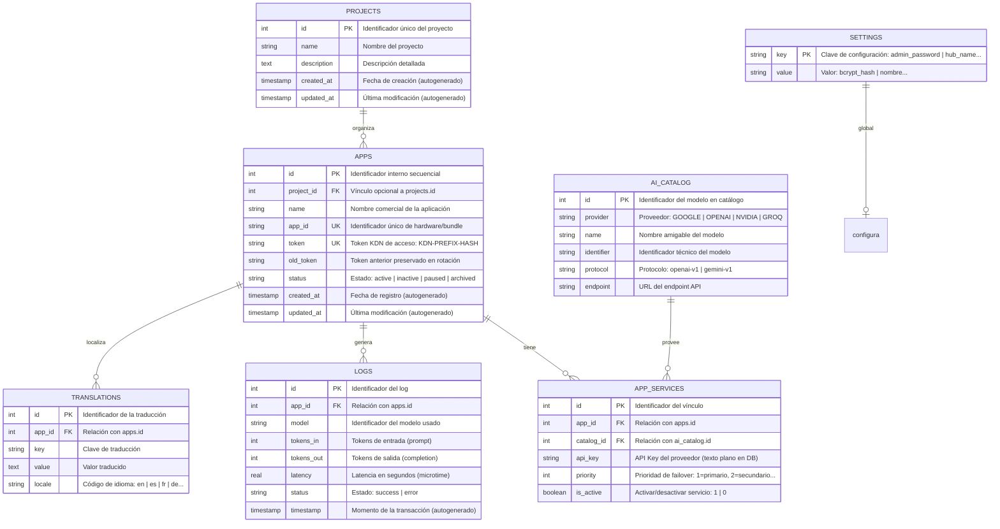
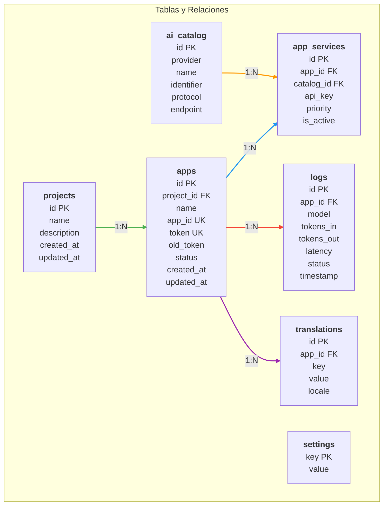
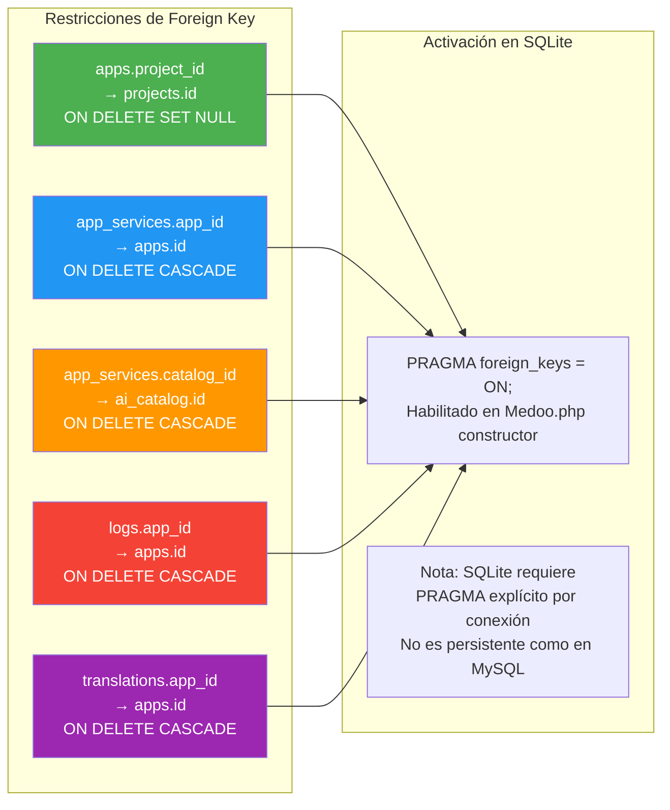

# White Paper 03: Diagrama de Relación de Entidades (ERD) de KodanHUB

> **KodanHUB — AI Gateway Centralizado**
> Versión: 1.0.49 | Clasificación: Interno / White Paper
> Fecha: 2026-05-26

---

## 1. Diagrama Entidad-Relación Completo



**Figura 1.1** — Diagrama entidad-relación completo del sistema KodanHUB con 6 tablas, 5 relaciones y todos los campos documentados.

---

## 2. Diccionario de Datos Detallado

### 2.1 Tabla: `projects`

Propósito: Agrupar aplicaciones en proyectos organizativos.

| Campo | Tipo SQL | Restricción | Default | Descripción Técnica |
|-------|----------|-------------|---------|---------------------|
| `id` | INTEGER | PK, AUTOINCREMENT | - | Identificador numérico auto-generado |
| `name` | TEXT | NOT NULL | - | Nombre del proyecto (ej: "Antigravity Suite") |
| `description` | TEXT | NULLABLE | NULL | Descripción textual del proyecto |
| `created_at` | TIMESTAMP | DEFAULT CURRENT_TIMESTAMP | now | Fecha de creación del registro |
| `updated_at` | TIMESTAMP | DEFAULT CURRENT_TIMESTAMP | now | Última modificación |

**Índices:**
- PK: `id`
- No tiene FK directas, pero `apps.project_id` referencia a `projects.id`

**DDL:**
```sql
CREATE TABLE projects (
    id INTEGER PRIMARY KEY AUTOINCREMENT,
    name TEXT NOT NULL,
    description TEXT,
    created_at TIMESTAMP DEFAULT CURRENT_TIMESTAMP,
    updated_at TIMESTAMP DEFAULT CURRENT_TIMESTAMP
);
```

---

### 2.2 Tabla: `apps`

Propósito: **Tabla central del sistema**. Almacena las credenciales, estado y metadatos de cada aplicación cliente registrada en el Hub.

| Campo | Tipo SQL | Restricción | Default | Descripción Técnica |
|-------|----------|-------------|---------|---------------------|
| `id` | INTEGER | PK, AUTOINCREMENT | - | ID interno secuencial |
| `project_id` | INTEGER | FK → projects.id, NULLABLE | NULL | Proyecto al que pertenece la app |
| `name` | TEXT | NOT NULL | - | Nombre comercial human-readable |
| `app_id` | TEXT | UNIQUE, NOT NULL | - | **Secreto compartido**: identifica la app. Ej: `SC-MASTER-8DAC5...` |
| `token` | TEXT | UNIQUE, NOT NULL | - | **KDN Token**: formato `KDN-PREFIX-16CHARHASH` |
| `old_token` | TEXT | NULLABLE | NULL | **Token anterior**: preservado durante rotación para forensía |
| `status` | TEXT | CHECK(status IN ('active','inactive','paused','archived')) | 'active' | Estado operativo de la app |
| `created_at` | TIMESTAMP | DEFAULT CURRENT_TIMESTAMP | now | Momento del registro inicial (handshake) |
| `updated_at` | TIMESTAMP | DEFAULT CURRENT_TIMESTAMP | now | Última actualización del registro |

**Índices:**
- PK: `id`
- UK: `app_id` (búsqueda por handshake)
- UK: `token` (búsqueda por proxy)
- FK: `project_id` → projects.id

**DDL:**
```sql
CREATE TABLE apps (
    id INTEGER PRIMARY KEY AUTOINCREMENT,
    project_id INTEGER,
    name TEXT NOT NULL,
    app_id TEXT UNIQUE NOT NULL,
    token TEXT UNIQUE NOT NULL,
    old_token TEXT,
    status TEXT DEFAULT 'active' CHECK(status IN ('active','inactive','paused','archived')),
    created_at TIMESTAMP DEFAULT CURRENT_TIMESTAMP,
    updated_at TIMESTAMP DEFAULT CURRENT_TIMESTAMP,
    FOREIGN KEY (project_id) REFERENCES projects(id)
);

CREATE INDEX idx_apps_app_id ON apps(app_id);
CREATE INDEX idx_apps_token ON apps(token);
CREATE INDEX idx_apps_status ON apps(status);
```

**Estados y Transiciones:**

```
                  ┌──────────┐
                  │  ACTIVE  │ ◄── Handshake OK / Proxy OK
                  └────┬─────┘
                       │
              ┌────────┼────────┐
              │        │        │
              ▼        ▼        ▼
         ┌────────┐ ┌──────┐ ┌─────────┐
         │INACTIVE│ │PAUSED│ │ARCHIVED │
         └────────┘ └──────┘ └─────────┘
              │        │
              └────────┘
                  │
                  ▼
              ┌────────┐
              │ ACTIVE │ ◄── Toggle desde admin
              └────────┘
```

---

### 2.3 Tabla: `ai_catalog`

Propósito: **Catálogo de modelos de IA** disponibles en el Hub. Cada registro representa un modelo con su proveedor, protocolo y endpoint.

| Campo | Tipo SQL | Restricción | Default | Descripción Técnica |
|-------|----------|-------------|---------|---------------------|
| `id` | INTEGER | PK, AUTOINCREMENT | - | ID del modelo en el catálogo |
| `provider` | TEXT | NOT NULL | - | Proveedor: `GOOGLE`, `OPENAI`, `NVIDIA`, `GROQ` |
| `name` | TEXT | NOT NULL | - | Nombre amigable: `Gemini 2.0 Flash` |
| `identifier` | TEXT | NOT NULL | - | ID técnico: `gemini-2.0-flash`, `gpt-4o-mini` |
| `protocol` | TEXT | NOT NULL | - | Protocolo de comunicación: `openai-v1` o `gemini-v1` |
| `endpoint` | TEXT | NOT NULL | - | URL del endpoint API del proveedor |

**Índices:**
- PK: `id`
- Se recomienda índice compuesto en `(provider, identifier)` para búsquedas

**DDL:**
```sql
CREATE TABLE ai_catalog (
    id INTEGER PRIMARY KEY AUTOINCREMENT,
    provider TEXT NOT NULL,
    name TEXT NOT NULL,
    identifier TEXT NOT NULL,
    protocol TEXT NOT NULL,
    endpoint TEXT NOT NULL
);

CREATE INDEX idx_catalog_provider ON ai_catalog(provider);
```

**Entradas de Ejemplo:**

| id | provider | name | identifier | protocol | endpoint |
|----|----------|------|-----------|----------|----------|
| 1 | GOOGLE | Gemini 2.0 Flash | gemini-2.0-flash | gemini-v1 | https://generativelanguage.googleapis.com/v1/models/ |
| 2 | GOOGLE | Gemini 1.5 Pro | gemini-1.5-pro | gemini-v1 | https://generativelanguage.googleapis.com/v1/models/ |
| 3 | OPENAI | GPT-4o Mini | gpt-4o-mini | openai-v1 | https://api.openai.com/v1/chat/completions |
| 4 | NVIDIA | Llama 3.1 8B | meta/llama-3.1-8b-instruct | openai-v1 | https://integrate.api.nvidia.com/v1/chat/completions |
| 5 | GROQ | Mixtral 8x7B | mixtral-8x7b-32768 | openai-v1 | https://api.groq.com/openai/v1/chat/completions |

---

### 2.4 Tabla: `app_services`

Propósito: **Tabla de vinculación** entre apps y modelos de IA. Define qué modelos puede usar cada app, con qué API Key, prioridad de failover y si está activo.

| Campo | Tipo SQL | Restricción | Default | Descripción Técnica |
|-------|----------|-------------|---------|---------------------|
| `id` | INTEGER | PK, AUTOINCREMENT | - | ID del vínculo |
| `app_id` | INTEGER | FK → apps.id, NOT NULL | - | App que recibe el servicio |
| `catalog_id` | INTEGER | FK → ai_catalog.id, NOT NULL | - | Modelo asignado |
| `api_key` | TEXT | NOT NULL | - | **API Key del proveedor** (texto plano) |
| `priority` | INTEGER | NOT NULL | 1 | Orden de failover: 1 = primero en intentarse |
| `is_active` | INTEGER | CHECK(is_active IN (0,1)) | 1 | Servicio activo (1) o desactivado (0) |

**Índices:**
- PK: `id`
- FK: `app_id` → apps.id
- FK: `catalog_id` → ai_catalog.id
- Se recomienda índice compuesto en `(app_id, priority)` para la query de failover

**DDL:**
```sql
CREATE TABLE app_services (
    id INTEGER PRIMARY KEY AUTOINCREMENT,
    app_id INTEGER NOT NULL,
    catalog_id INTEGER NOT NULL,
    api_key TEXT NOT NULL,
    priority INTEGER DEFAULT 1 NOT NULL,
    is_active INTEGER DEFAULT 1 CHECK(is_active IN (0, 1)),
    FOREIGN KEY (app_id) REFERENCES apps(id),
    FOREIGN KEY (catalog_id) REFERENCES ai_catalog(id)
);

CREATE INDEX idx_services_app ON app_services(app_id);
CREATE INDEX idx_services_priority ON app_services(app_id, priority);
```

**Query de Failover (JOIN):**
```sql
SELECT s.*, c.protocol, c.identifier, c.endpoint, c.provider 
FROM app_services s 
JOIN ai_catalog c ON s.catalog_id = c.id 
WHERE s.app_id = ? AND s.is_active = 1 
ORDER BY s.priority ASC
```

---

### 2.5 Tabla: `logs`

Propósito: **Auditoría de transacciones**. Cada request de IA exitoso o fallido genera un registro con métricas de uso, latencia y estado.

| Campo | Tipo SQL | Restricción | Default | Descripción Técnica |
|-------|----------|-------------|---------|---------------------|
| `id` | INTEGER | PK, AUTOINCREMENT | - | ID del registro de auditoría |
| `app_id` | INTEGER | FK → apps.id, NOT NULL | - | App que realizó la solicitud |
| `model` | TEXT | NOT NULL | - | Identificador del modelo usado |
| `tokens_in` | INTEGER | DEFAULT 0 | 0 | Tokens de entrada (prompt) |
| `tokens_out` | INTEGER | DEFAULT 0 | 0 | Tokens de salida (completion) |
| `latency` | REAL | NOT NULL | - | Tiempo de respuesta en segundos |
| `status` | TEXT | CHECK(status IN ('success','error')) | - | Resultado de la transacción |
| `timestamp` | TIMESTAMP | DEFAULT CURRENT_TIMESTAMP | now | Momento de la transacción |

**Índices:**
- PK: `id`
- FK: `app_id` → apps.id
- Se recomienda índice en `(app_id, timestamp)` para consultas de consumo
- Se recomienda índice en `(status, timestamp)` para consultas de errores

**DDL:**
```sql
CREATE TABLE logs (
    id INTEGER PRIMARY KEY AUTOINCREMENT,
    app_id INTEGER NOT NULL,
    model TEXT NOT NULL,
    tokens_in INTEGER DEFAULT 0,
    tokens_out INTEGER DEFAULT 0,
    latency REAL NOT NULL,
    status TEXT NOT NULL CHECK(status IN ('success', 'error')),
    timestamp TIMESTAMP DEFAULT CURRENT_TIMESTAMP,
    FOREIGN KEY (app_id) REFERENCES apps(id)
);

CREATE INDEX idx_logs_app ON logs(app_id);
CREATE INDEX idx_logs_timestamp ON logs(timestamp);
CREATE INDEX idx_logs_app_timestamp ON logs(app_id, timestamp);
CREATE INDEX idx_logs_status ON logs(status);
```

**Extracción de Tokens por Protocolo (LogService.php):**

```php
public static function extractTokens($data, $protocol = 'gemini-v1') {
    if ($protocol === 'openai-v1') {
        // OpenAI / NVIDIA / Groq
        $in = $data['usage']['prompt_tokens'] ?? 0;
        $out = $data['usage']['completion_tokens'] ?? 0;
    } else {
        // Gemini
        $in = $data['usageMetadata']['promptTokenCount'] ?? 0;
        $out = $data['usageMetadata']['candidatesTokenCount'] ?? 0;
    }
    return [$in, $out];
}
```

---

### 2.6 Tabla: `translations`

Propósito: **Sistema de internacionalización (i18n)**. Permite que las aplicaciones almacenen traducciones de claves en múltiples idiomas, sincronizadas a través del Hub.

| Campo | Tipo SQL | Restricción | Default | Descripción Técnica |
|-------|----------|-------------|---------|---------------------|
| `id` | INTEGER | PK, AUTOINCREMENT | - | ID de la traducción |
| `app_id` | INTEGER | FK → apps.id, NOT NULL | - | App propietaria de la traducción |
| `key` | TEXT | NOT NULL | - | Clave de traducción (ej: `welcome_message`) |
| `value` | TEXT | NOT NULL | - | Texto traducido |
| `locale` | TEXT | NOT NULL | - | Código de idioma: `en`, `es`, `fr`, `de` |

**Índices:**
- PK: `id`
- FK: `app_id` → apps.id
- Se recomienda UK compuesta en `(app_id, key, locale)` para evitar duplicados

**DDL:**
```sql
CREATE TABLE translations (
    id INTEGER PRIMARY KEY AUTOINCREMENT,
    app_id INTEGER NOT NULL,
    key TEXT NOT NULL,
    value TEXT NOT NULL,
    locale TEXT NOT NULL,
    FOREIGN KEY (app_id) REFERENCES apps(id)
);

CREATE UNIQUE INDEX idx_translations_unique ON translations(app_id, key, locale);
CREATE INDEX idx_translations_app ON translations(app_id);
```

---

### 2.7 Tabla: `settings`

Propósito: **Configuración clave-valor** del sistema. Almacena opciones globales como el hash bcrypt de la contraseña de administrador.

| Campo | Tipo SQL | Restricción | Default | Descripción Técnica |
|-------|----------|-------------|---------|---------------------|
| `key` | TEXT | PK | - | Clave de configuración |
| `value` | TEXT | NOT NULL | - | Valor de la configuración |

**DDL:**
```sql
CREATE TABLE settings (
    key TEXT PRIMARY KEY,
    value TEXT NOT NULL
);
```

**Entradas de Ejemplo:**

| key | value |
|-----|-------|
| `admin_password` | `$2y$10$92IXUNpkjO0rOQ5byMi.Ye4oKoEa3Ro9llC/.og/at2.uheWG/igi` |
| `hub_name` | `KodanHUB Production` |
| `maintenance_mode` | `false` |

---

## 3. Diagrama de Cardinalidad Detallado



**Figura 3.1** — Diagrama de cardinalidad con todas las tablas, campos y relaciones del sistema.

---

## 4. Integridad Referencial (Foreign Keys)



---

## 5. Volumen de Datos y Growth Projections

| Tabla | Tamaño por Registro | Crecimiento Estimado (mes) | Proyección 12 meses |
|-------|--------------------|---------------------------|---------------------|
| `apps` | ~512 bytes | +5 apps | ~60 apps (~30KB) |
| `ai_catalog` | ~256 bytes | +2 modelos | ~24 modelos (~6KB) |
| `app_services` | ~128 bytes | +15 servicios | ~180 servicios (~23KB) |
| `logs` | ~192 bytes | +15,000 registros | ~180,000 registros (~34MB) |
| `translations` | ~512 bytes | +1,000 claves | ~12,000 claves (~6MB) |
| `settings` | ~128 bytes | 0 (estático) | ~1KB |

**Conclusión:** SQLite maneja sin problema este volumen de datos. El archivo `hub.sqlite` crecerá aproximadamente ~35-40MB en un año con uso normal.

---

## 6. Esquema SQL Completo (DDL)

```sql
-- ============================================================
-- KODAN-HUB Database Schema v1.0.49
-- SQLite 3.x | Generado: 2026-05-26
-- ============================================================

-- Habilitar integridad referencial
PRAGMA foreign_keys = ON;

-- Tabla 1: projects (opcional)
CREATE TABLE IF NOT EXISTS projects (
    id INTEGER PRIMARY KEY AUTOINCREMENT,
    name TEXT NOT NULL,
    description TEXT,
    created_at TIMESTAMP DEFAULT CURRENT_TIMESTAMP,
    updated_at TIMESTAMP DEFAULT CURRENT_TIMESTAMP
);

-- Tabla 2: apps (central)
CREATE TABLE IF NOT EXISTS apps (
    id INTEGER PRIMARY KEY AUTOINCREMENT,
    project_id INTEGER,
    name TEXT NOT NULL,
    app_id TEXT UNIQUE NOT NULL,
    token TEXT UNIQUE NOT NULL,
    old_token TEXT,
    status TEXT DEFAULT 'active' CHECK(status IN ('active','inactive','paused','archived')),
    created_at TIMESTAMP DEFAULT CURRENT_TIMESTAMP,
    updated_at TIMESTAMP DEFAULT CURRENT_TIMESTAMP,
    FOREIGN KEY (project_id) REFERENCES projects(id)
);

CREATE INDEX IF NOT EXISTS idx_apps_app_id ON apps(app_id);
CREATE INDEX IF NOT EXISTS idx_apps_token ON apps(token);
CREATE INDEX IF NOT EXISTS idx_apps_status ON apps(status);

-- Tabla 3: ai_catalog
CREATE TABLE IF NOT EXISTS ai_catalog (
    id INTEGER PRIMARY KEY AUTOINCREMENT,
    provider TEXT NOT NULL,
    name TEXT NOT NULL,
    identifier TEXT NOT NULL,
    protocol TEXT NOT NULL,
    endpoint TEXT NOT NULL
);

CREATE INDEX IF NOT EXISTS idx_catalog_provider ON ai_catalog(provider);

-- Tabla 4: app_services (vinculación)
CREATE TABLE IF NOT EXISTS app_services (
    id INTEGER PRIMARY KEY AUTOINCREMENT,
    app_id INTEGER NOT NULL,
    catalog_id INTEGER NOT NULL,
    api_key TEXT NOT NULL,
    priority INTEGER DEFAULT 1 NOT NULL,
    is_active INTEGER DEFAULT 1 CHECK(is_active IN (0, 1)),
    FOREIGN KEY (app_id) REFERENCES apps(id),
    FOREIGN KEY (catalog_id) REFERENCES ai_catalog(id)
);

CREATE INDEX IF NOT EXISTS idx_services_app ON app_services(app_id);
CREATE INDEX IF NOT EXISTS idx_services_priority ON app_services(app_id, priority);

-- Tabla 5: logs (auditoría)
CREATE TABLE IF NOT EXISTS logs (
    id INTEGER PRIMARY KEY AUTOINCREMENT,
    app_id INTEGER NOT NULL,
    model TEXT NOT NULL,
    tokens_in INTEGER DEFAULT 0,
    tokens_out INTEGER DEFAULT 0,
    latency REAL NOT NULL,
    status TEXT NOT NULL CHECK(status IN ('success', 'error')),
    timestamp TIMESTAMP DEFAULT CURRENT_TIMESTAMP,
    FOREIGN KEY (app_id) REFERENCES apps(id)
);

CREATE INDEX IF NOT EXISTS idx_logs_app ON logs(app_id);
CREATE INDEX IF NOT EXISTS idx_logs_timestamp ON logs(timestamp);
CREATE INDEX IF NOT EXISTS idx_logs_app_timestamp ON logs(app_id, timestamp);
CREATE INDEX IF NOT EXISTS idx_logs_status ON logs(status);

-- Tabla 6: translations (i18n)
CREATE TABLE IF NOT EXISTS translations (
    id INTEGER PRIMARY KEY AUTOINCREMENT,
    app_id INTEGER NOT NULL,
    key TEXT NOT NULL,
    value TEXT NOT NULL,
    locale TEXT NOT NULL,
    FOREIGN KEY (app_id) REFERENCES apps(id)
);

CREATE UNIQUE INDEX IF NOT EXISTS idx_translations_unique ON translations(app_id, key, locale);
CREATE INDEX IF NOT EXISTS idx_translations_app ON translations(app_id);

-- Tabla 7: settings (configuración global)
CREATE TABLE IF NOT EXISTS settings (
    key TEXT PRIMARY KEY,
    value TEXT NOT NULL
);
```

---

## Referencias

- Código fuente: `src/Core/Medoo.php`, `src/Services/LogService.php`
- Implementación: `index.php` (queries), `admin/actions.php` (CRUD)
- Documentación existente: `docs/database_schema.md`
- [SQLite PRAGMA foreign_keys](https://www.sqlite.org/pragma.html#pragma_foreign_keys)
- [SQLite Column Constraints](https://www.sqlite.org/lang_createtable.html#constraints)

---

> **Fin de White Paper 03** — Próximo documento: White Paper 04 - Diagramas de Interacción de APIs
