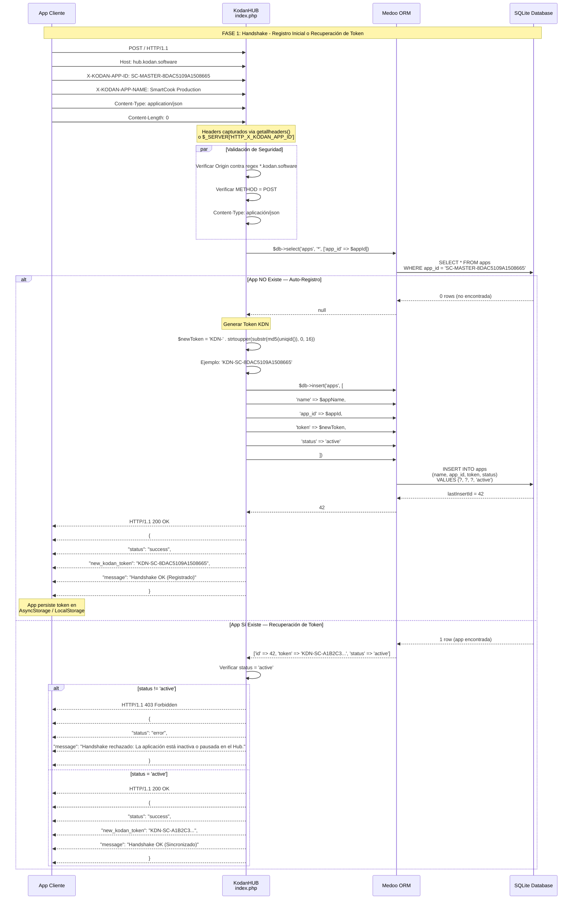
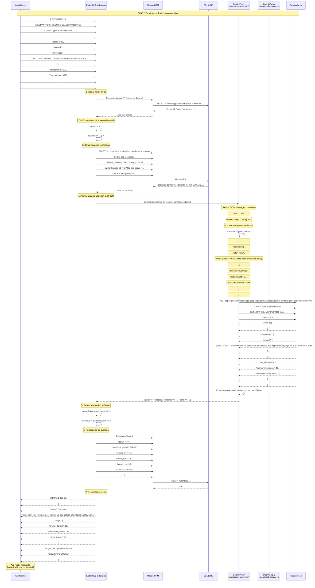
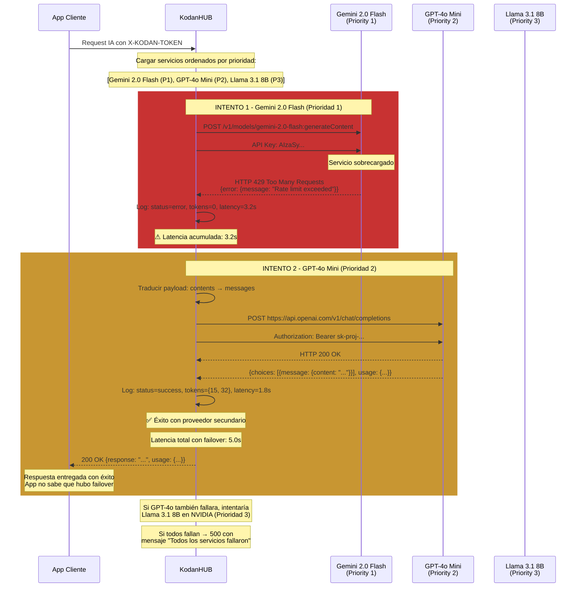
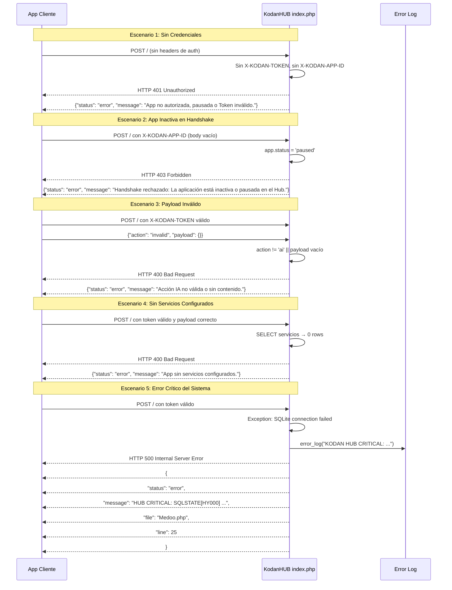
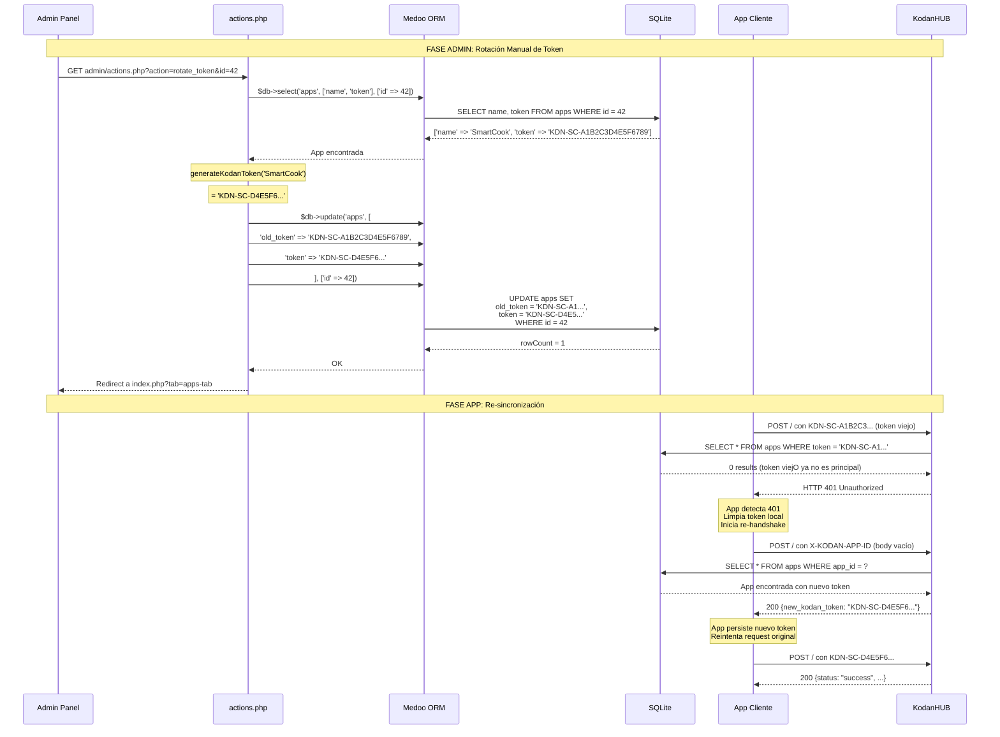
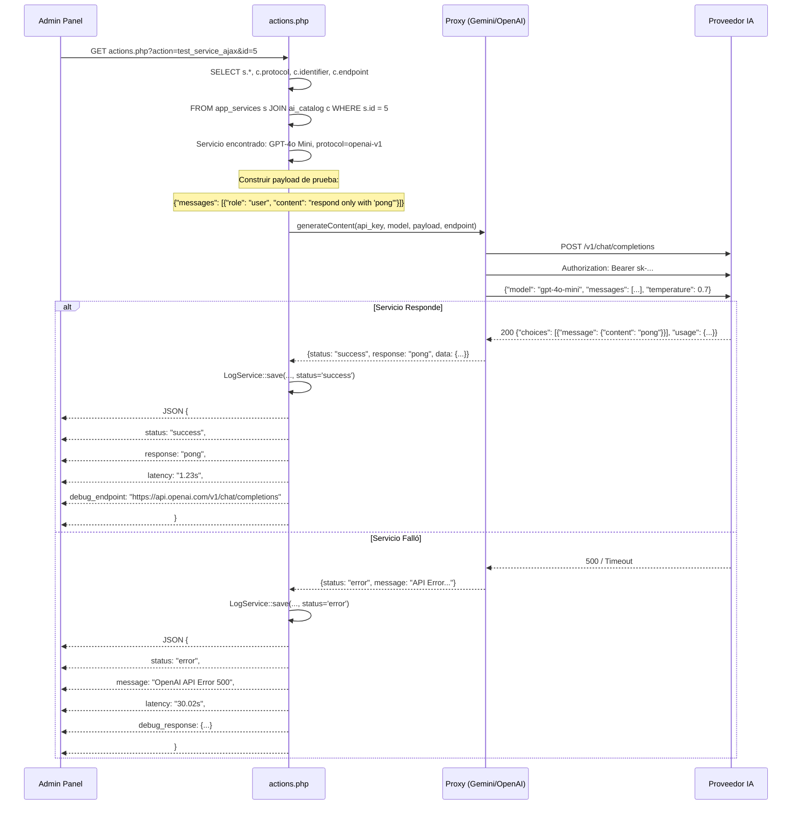
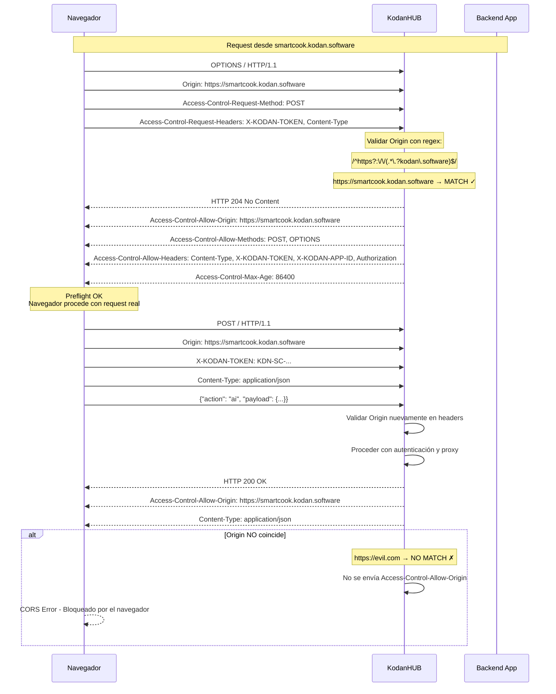
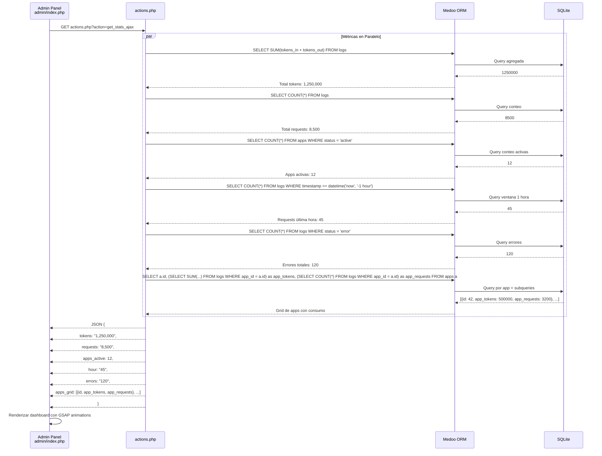

# White Paper 04: Diagramas de Interacción de APIs de KodanHUB

> **KodanHUB — AI Gateway Centralizado**
> Versión: 1.0.49 | Clasificación: Interno / White Paper
> Fecha: 2026-05-26

---

## 1. Diagrama de Secuencia: Handshake Completo



**Figura 1.1** — Secuencia completa del handshake con validación, auto-registro y recuperación.

### Request/Response del Handshake

**Request:**
```http
POST / HTTP/1.1
Host: hub.kodan.software
X-KODAN-APP-ID: SC-MASTER-8DAC5109A1508665
X-KODAN-APP-NAME: SmartCook Production
Content-Type: application/json
Content-Length: 0
```

**Response (Registro exitoso):**
```json
{
  "status": "success",
  "new_kodan_token": "KDN-SC-8DAC5109A1508665",
  "message": "Handshake OK (Registrado)"
}
```

**Response (Recuperación exitosa):**
```json
{
  "status": "success",
  "new_kodan_token": "KDN-SC-A1B2C3D4E5F6789",
  "message": "Handshake OK (Sincronizado)"
}
```

**Response (App inactiva):**
```json
{
  "status": "error",
  "message": "Handshake rechazado: La aplicación está inactiva o pausada en el Hub."
}
```

---

## 2. Diagrama de Secuencia: Proxy IA con Traducción de Protocolo



**Figura 2.1** — Secuencia completa de proxy IA con traducción de protocolo, extracción de tokens y auditoría.

### Request/Response del Proxy IA

**Request:**
```http
POST / HTTP/1.1
Host: hub.kodan.software
X-KODAN-TOKEN: KDN-SC-8DAC5109A1508665
Content-Type: application/json

{
  "action": "ai",
  "payload": {
    "messages": [
      {"role": "user", "content": "Analiza este texto: El cielo es azul"}
    ],
    "temperature": 0.5,
    "max_tokens": 4096
  }
}
```

**Response exitosa:**
```json
{
  "status": "success",
  "response": "Efectivamente, el cielo se ve azul debido a la dispersión Rayleigh de la luz solar en la atmósfera.",
  "usage": {
    "prompt_tokens": 15,
    "completion_tokens": 32,
    "total_tokens": 47
  },
  "hub_model": "gemini-2.0-flash",
  "provider": "GOOGLE"
}
```

---

## 3. Diagrama de Secuencia: Failover entre Proveedores



**Figura 3.1** — Secuencia de failover donde Gemini falla (429) y se recupera automáticamente con GPT-4o Mini.

### Código de Failover (index.php)

```php
foreach ($services as $service) {
    $startTime = microtime(true);
    
    if ($service['protocol'] === 'openai-v1') {
        $result = OpenAIProxy::generateContent(...);
    } else {
        $result = GeminiProxy::generateContent(...);
    }
    
    $latency = round(microtime(true) - $startTime, 2);

    if ($result['status'] === 'success') {
        $tokens = LogService::extractTokens($result['data'], $service['protocol']);
        LogService::save($app['id'], $service['identifier'], $tokens[0], $tokens[1], $latency, 'success');
        echo json_encode([...]); // ❗ exit inmediato
        exit;
    } else {
        LogService::save($app['id'], $service['identifier'], 0, 0, $latency, 'error');
        // ❗ Siguiente iteración del foreach
    }
}
// Si se termina el foreach sin éxito:
echo json_encode(['status' => 'error', 'message' => 'Todos los servicios de IA fallaron.']);
```

---

## 4. Diagrama de Secuencia: Traducción Bidireccional de Protocolo

### 4.1 OpenAI a Gemini (GeminiProxy)

```mermaid
sequenceDiagram
    participant H as KodanHUB index.php
    participant GP as GeminiProxy.php
    participant AI as Gemini API

    H->>GP: generateContent(apiKey, model, payload, endpoint)
    
    Note over GP: Payload entrante (formato OpenAI):
    Note over GP: {
    Note over GP:   "messages": [
    Note over GP:     {"role": "user", "content": "Hola"},
    Note over GP:     {"role": "assistant", "content": "¿Cómo estás?"},
    Note over GP:     {"role": "user", "content": [
    Note over GP:       {"type": "text", "text": "Analiza esta imagen"},
    Note over GP:       {"type": "image_url", "image_url": {
    Note over GP:         "url": "data:image/jpeg;base64,/9j/4AAQ..."
    Note over GP:       }}
    Note over GP:     ]}
    Note over GP:   ],
    Note over GP:   "temperature": 0.7,
    Note over GP:   "max_tokens": 4096
    Note over GP: }
    
    GP->>GP: 1. contents[] existe? → NO
    GP->>GP: 2. messages[] existe? → SÍ
    
    GP->>GP: 3. Iterar cada mensaje:
    
    Note over GP: Message 1: user "Hola"
    GP->>GP: role 'user' → 'user' (sin cambios)
    GP->>GP: content string → parts[0].text = "Hola"
    
    Note over GP: Message 2: assistant "¿Cómo estás?"
    GP->>GP: role 'assistant' → 'model'
    GP->>GP: content string → parts[0].text = "¿Cómo estás?"
    
    Note over GP: Message 3: user [text + image]
    GP->>GP: type 'text' → parts[].text
    GP->>GP: type 'image_url' → regex extrae mimeType y base64
    GP->>GP: Construye parts[].inlineData = {mimeType, data}
    
    Note over GP: 4. Construir payload Gemini:
    Note over GP: {
    Note over GP:   "contents": [
    Note over GP:     {"role": "user", "parts": [{"text": "Hola"}]},
    Note over GP:     {"role": "model", "parts": [{"text": "¿Cómo estás?"}]},
    Note over GP:     {"role": "user", "parts": [
    Note over GP:       {"text": "Analiza esta imagen"},
    Note over GP:       {"inlineData": {"mimeType": "image/jpeg", "data": "/9j/4AAQ..."}}
    Note over GP:     ]}
    Note over GP:   ],
    Note over GP:   "generationConfig": {
    Note over GP:     "temperature": 0.7,
    Note over GP:     "maxOutputTokens": 4096
    Note over GP:   }
    Note over GP: }
    
    GP->>AI: POST con payload traducido
    
    AI-->>GP: HTTP 200 Response
    
    Note over GP: 5. Extraer respuesta:
    GP->>GP: data.candidates[0].content.parts[0].text
    GP->>GP: data.usageMetadata.promptTokenCount
    GP->>GP: data.usageMetadata.candidatesTokenCount
    
    GP-->>H: {status, http_code, response, data, message}
```

### 4.2 Gemini a OpenAI (OpenAIProxy)

```mermaid
sequenceDiagram
    participant H as KodanHUB index.php
    participant OP as OpenAIProxy.php
    participant AI as OpenAI / NVIDIA / Groq

    H->>OP: generateContent(apiKey, model, payload, endpoint)
    
    Note over OP: Payload entrante (formato Gemini):
    Note over OP: {
    Note over OP:   "contents": [
    Note over OP:     {"role": "user", "parts": [{"text": "Hola"}]},
    Note over OP:     {"role": "model", "parts": [{"text": "¿Cómo estás?"}]},
    Note over OP:     {"role": "user", "parts": [
    Note over OP:       {"text": "Analiza esta imagen"},
    Note over OP:       {"inlineData": {"mimeType": "image/jpeg", "data": "/9j/4AAQ..."}}
    Note over OP:     ]}
    Note over OP:   ]
    Note over OP: }
    
    OP->>OP: 1. messages[] existe? → NO
    OP->>OP: 2. contents[] existe? → SÍ
    
    OP->>OP: 3. Iterar cada content:
    
    Note over OP: Content 1: user parts[0].text
    OP->>OP: role 'user' → 'user'
    OP->>OP: parts[0].text → content string
    
    Note over OP: Content 2: model parts[0].text
    OP->>OP: role 'model' → 'assistant'
    OP->>OP: parts[0].text → content string
    
    Note over OP: Content 3: user [text + inlineData]
    OP->>OP: parts[0].text → content[0].text
    OP->>OP: parts[1].inlineData → content[1].image_url
    OP->>OP: Construir data URI: data:mimeType;base64,data
    
    Note over OP: 4. Construir payload OpenAI:
    Note over OP: {
    Note over OP:   "model": "gpt-4o-mini",
    Note over OP:   "messages": [
    Note over OP:     {"role": "user", "content": "Hola"},
    Note over OP:     {"role": "assistant", "content": "¿Cómo estás?"},
    Note over OP:     {"role": "user", "content": [
    Note over OP:       {"type": "text", "text": "Analiza esta imagen"},
    Note over OP:       {"type": "image_url", "image_url": {
    Note over OP:         "url": "data:image/jpeg;base64,/9j/4AAQ..."
    Note over OP:       }}
    Note over OP:     ]}
    Note over OP:   ],
    Note over OP:   "temperature": 0.7,
    Note over OP:   "max_tokens": 4096
    Note over OP: }
    
    Note over OP: 5. Safety: si messages sigue vacío
    Note over OP:    inyectar mensaje dummy para evitar error 400 de NVIDIA
    
    OP->>AI: POST con payload traducido
    OP->>AI: Authorization: Bearer sk-proj-...
    
    AI-->>OP: HTTP 200 Response
    
    Note over OP: 6. Extraer respuesta:
    OP->>OP: data.choices[0].message.content
    OP->>OP: data.usage.prompt_tokens
    OP->>OP: data.usage.completion_tokens
    
    OP-->>H: {status, http_code, response, data, message}
```

---

## 5. Diagrama de Secuencia: Manejo de Errores y Excepciones



**Figura 5.1** — Diagrama de errores con 5 escenarios distintos de fallo.

### Matriz de Códigos de Error

| HTTP Status | Condición | Respuesta |
|-------------|-----------|-----------|
| `200 OK` | Handshake exitoso o Proxy exitoso | `{"status": "success", ...}` |
| `400 Bad Request` | Payload inválido o sin servicios | `{"status": "error", "message": "..."}` |
| `401 Unauthorized` | Token inválido o ausente | `{"status": "error", "message": "..."}` |
| `403 Forbidden` | App inactiva/pausada | `{"status": "error", "message": "..."}` |
| `405 Method Not Allowed` | Método no POST | Bloqueado por CORS |
| `500 Internal Server Error` | Excepción no capturada | `{"status": "error", "message": "HUB CRITICAL: ...", "file": "...", "line": N}` |

---

## 6. Diagrama de Secuencia: Rotación de Tokens



**Figura 6.1** — Secuencia de rotación manual de token desde el admin hasta la re-sincronización de la app.

---

## 7. Diagrama de Secuencia: Diagnóstico de Servicios (Ping)



**Figura 7.1** — Secuencia de diagnóstico de servicios desde el panel de administración.

---

## 8. Diagrama de Secuencia: CORS y OPTIONS Preflight



**Figura 8.1** — Secuencia completa de CORS preflight con OPTIONS y validación de origen.

---

## 9. Diagrama de Secuencia: Administración (Dashboard Stats)



**Figura 9.1** — Secuencia de obtención de estadísticas del dashboard administrativo con queries paralelas.

---

## 10. Mapa Completo de Endpoints

```mermaid
graph TB
    subgraph "Endpoints Públicos (index.php)"
        POST_ROOT[POST /<br/>Entry Point<br/>Content-Type: application/json]
        OPTIONS[OPTIONS /<br/>CORS Preflight]
    end

    subgraph "Endpoints de Administración (actions.php)"
        ADD_APP[add_app<br/>Crear nueva app]
        ROTATE_TOKEN[rotate_token<br/>Rotar KDN token]
        UPDATE_NAME[update_app_name<br/>Renombrar app]
        DELETE_APP[delete_app<br/>Archivar app]
        TOGGLE_STATUS[toggle_status<br/>Activar/Desactivar]
        ADD_MODEL[add_catalog_model<br/>Agregar modelo IA]
        EDIT_MODEL[edit_catalog_model<br/>Editar modelo]
        DELETE_MODEL[delete_catalog_model<br/>Eliminar modelo]
        ADD_SERVICE[add_app_service<br/>Asignar servicio]
        EDIT_SERVICE[edit_app_service<br/>Editar servicio]
        DELETE_SERVICE[delete_service<br/>Desvincular servicio]
        TEST_SERVICE[test_service_ajax<br/>Diagnóstico ping]
        STATS_AJAX[get_stats_ajax<br/>Dashboard metrics]
        ERRORS_AJAX[get_errors_ajax<br/>Error logs]
        CONSUMPTION[get_consumption_stats_ajax<br/>Consumo filtrado]
    end

    subgraph "Endpoints de IA (Proxies)"
        GEMINI[Gemini API<br/>generativelanguage.googleapis.com]
        OPENAI[OpenAI API<br/>api.openai.com]
        NVIDIA[NVIDIA API<br/>integrate.api.nvidia.com]
        GROQ[Groq API<br/>api.groq.com]
    end

    POST_ROOT -->|Handshake| ROTATE_TOKEN
    POST_ROOT -->|Proxy IA| GEMINI
    POST_ROOT -->|Proxy IA| OPENAI
    POST_ROOT -->|Proxy IA| NVIDIA
    POST_ROOT -->|Proxy IA| GROQ
```



**Figura 10.1** — Mapa completo de todos los endpoints del sistema KodanHUB.

---

## Referencias

- Código fuente: `index.php`, `admin/actions.php`, `src/Services/*.php`
- Flujo de handshake: `docs/whitepaper_02_flow_diagrams.md`
- [Mermaid Sequence Diagram Documentation](https://mermaid.js.org/syntax/sequenceDiagram.html)
- [HTTP CORS Specification](https://developer.mozilla.org/en-US/docs/Web/HTTP/CORS)

---

> **Fin de White Paper 04** — Próximo documento: HTML Maestro Exportable a PDF
