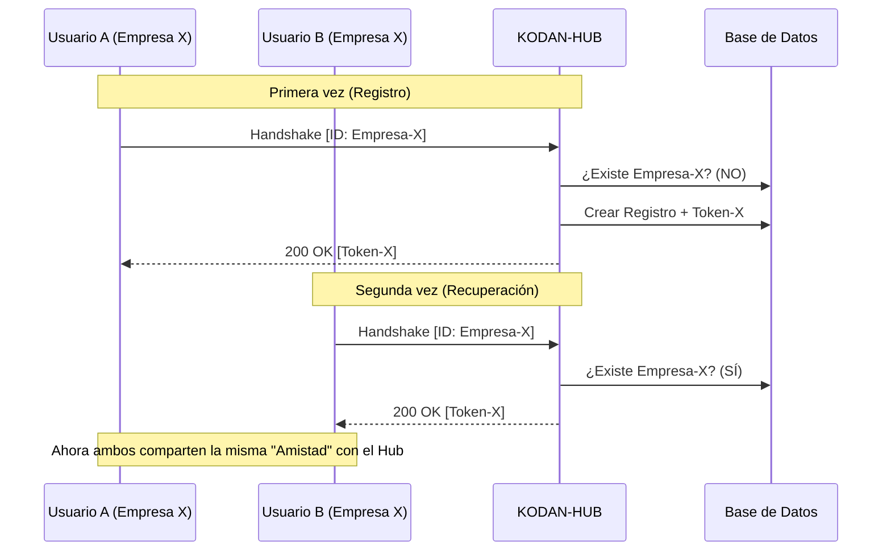

# Handshake e Identidad Compartida: Manual de Integración KodanHUB

Este documento detalla el protocolo de comunicación entre aplicaciones cliente (SmartCook, TimeTracker, etc.) y el **KODAN-HUB AI Gateway**, con especial énfasis en el soporte para cientos de usuarios concurrentes mediante el modelo de **Identidad Compartida**.

---

## 1. Conceptos Fundamentales

### 1.1 El App-ID como Ancla de Identidad
A diferencia de otros sistemas donde cada usuario tiene su propia API Key, en KodanHUB el acceso se gestiona a nivel de **Instancia de Aplicación** o **Tenant (Empresa)**.

-   **X-KODAN-APP-ID**: Es el identificador único. 
    -   Para apps globales (SmartCook): Se usa un ID fijo (ej: `smartcook-global`).
    -   Para SaaS Multi-tenant (TimeTracker): Se usa un ID por empresa (ej: `TT-Globant-2026`).
-   **X-KODAN-TOKEN**: Es la llave de sesión generada por el Hub. Una vez obtenida mediante handshake, debe persistirse.

### 1.2 Handshake Idempotente (Recuperación Automática)
El handshake es el proceso de "presentación" de una app. Es **idempotente**, lo que significa que puedes llamarlo múltiples veces y el Hub siempre te dará la misma respuesta válida para ese ID.

---

## 2. Protocolo de Handshake

### Paso 1: Petición de Sincronización
La aplicación debe realizar un `POST` al root del Hub con el cuerpo del mensaje **vacío**.

**Headers Requeridos:**
```http
POST / HTTP/1.1
Host: hub.kodan.software
X-KODAN-APP-ID: [TU_ID_UNICO]
X-KODAN-APP-NAME: [NOMBRE_AMIGABLE]
Content-Length: 0
```

### Paso 2: Procesamiento del Hub
El Hub sigue esta lógica interna:
1.  **¿Existe el ID?**
    -   **NO**: Crea un nuevo registro, genera un Token aleatorio y lo devuelve.
    -   **SÍ**: Recupera el Token existente del registro y lo devuelve.
2.  **Respuesta JSON:**
```json
{
  "status": "success",
  "new_kodan_token": "KDN-XXXXXXXXXXXXXXXX",
  "message": "Handshake OK (Sincronizado)"
}
```

---

## 3. Estrategias de Implementación

### 3.1 Modelo App Global (Ej: SmartCook)
Ideal para apps de consumo masivo donde no hay distinción de empresas.
-   **Estrategia:** Hardcodear el `APP-ID` en el binario.
-   **Flujo:** Todos los usuarios del mundo envían el mismo ID -> El Hub les da a todos el mismo Token -> El consumo se agrupa bajo una sola entrada "SmartCook" en el panel de administración.

### 3.2 Modelo SaaS Multi-tenant (Ej: TimeTracker)
Ideal para plataformas B2B donde cada cliente debe tener su propia cuota o métricas.
-   **Estrategia:** Generar un `APP-ID` único por Empresa (Tenant) en el momento de la creación de la cuenta.
-   **Flujo:** Todos los empleados de "Empresa A" usan el `ID-A` -> El Hub les da el `Token-A`. Los de "Empresa B" obtienen el `Token-B`.
-   **Métricas:** El administrador del Hub puede ver exactamente cuánto gasta cada cliente en IA.

---

## 4. Mejores Prácticas

1.  **Persistencia Local:** Aunque el handshake es idempotente, las apps deben guardar el token en `AsyncStorage` (Mobile) o en la DB (Web) para evitar llamadas innecesarias al Hub.
2.  **Re-Sincronización:** Si una app recibe un error `401 Unauthorized`, debe borrar su token local y volver a realizar el Handshake.
3.  **Seguridad por Ofuscación:** Dado que el `APP-ID` es la llave para obtener el token, evita exponerlo en logs públicos o URLs.

---

## 5. Diagrama de Secuencia (Escalado)


